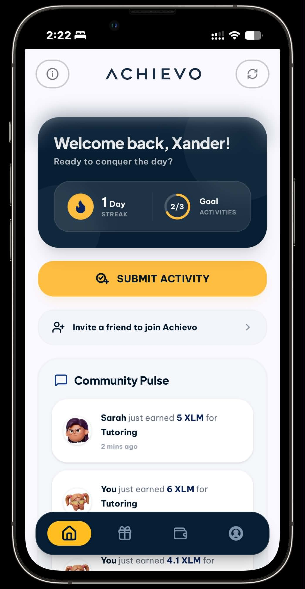
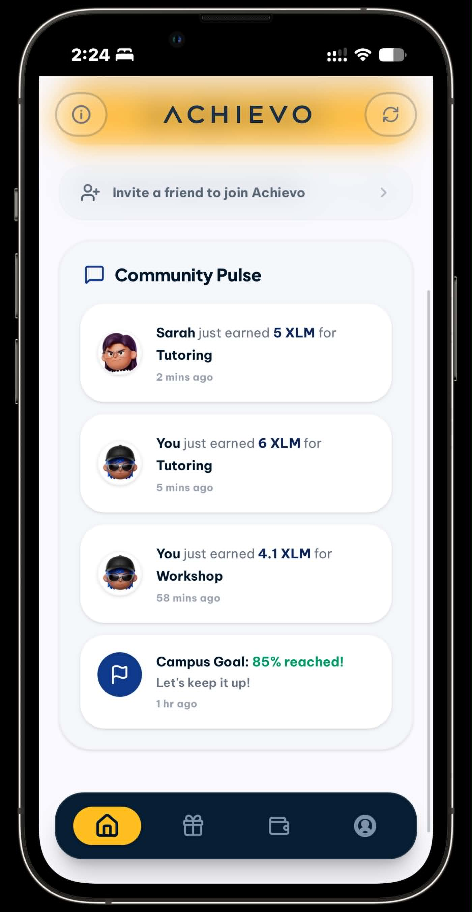
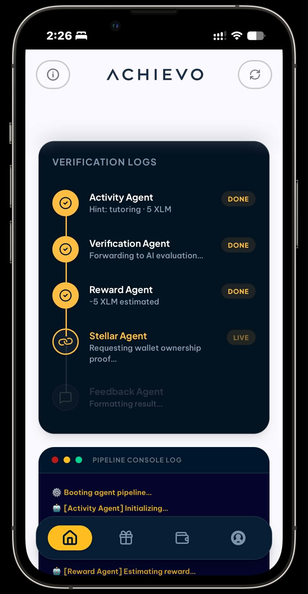
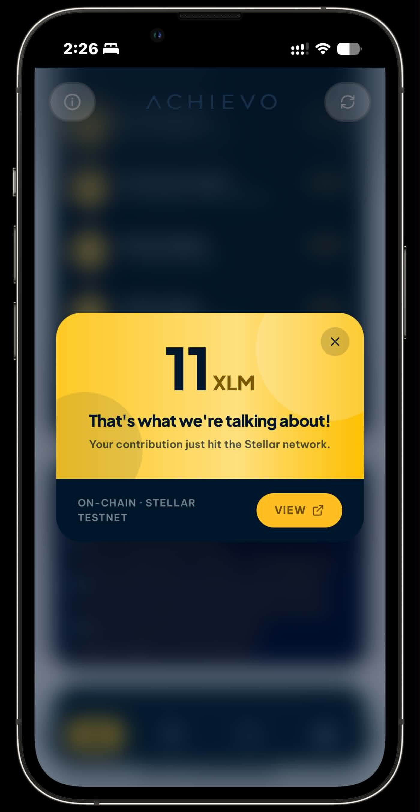
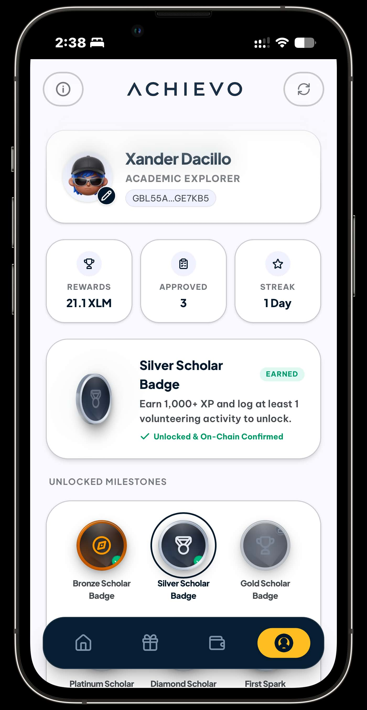
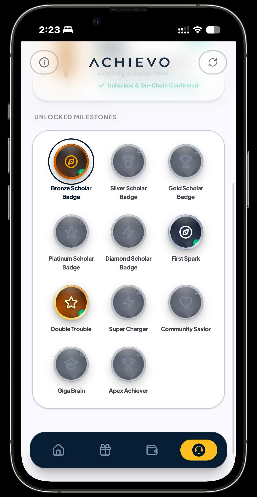
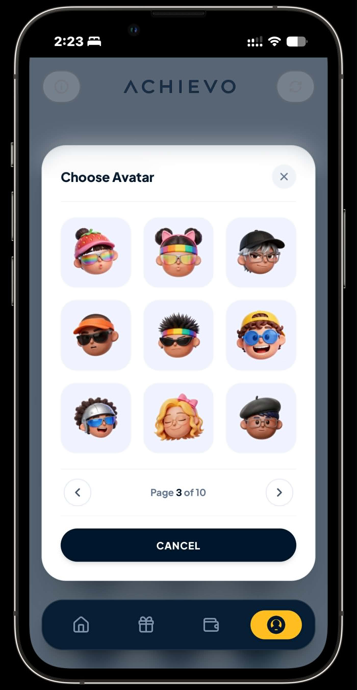

<p align="center">
  
</p>

# Achievo — AI Student Reward System on Stellar

> Earn XLM automatically for your academic achievements — powered by a 5-agent AI pipeline and Soroban smart contracts on the Stellar Testnet.

Students connect their wallet, describe what they did, and Achievo's AI pipeline evaluates the submission and sends XLM directly to their wallet — no manual approval, no middleman.

**[Live Demo →](https://achievo-rust.vercel.app)**

---

## Screenshots

<p align="center">
  
  
  
  
</p>
<p align="center">
  
  
  
</p>

---

## Features

- 🤖 **5-Agent AI Pipeline** — Activity → Verification → Reward → Stellar → Feedback
- ⛓️ **On-Chain Payouts** — XLM sent via Soroban treasury contract, every transaction verifiable on StellarExpert
- 🔐 **Wallet Ownership Proof** — nonce-based challenge/signature before every payout (prevents spoofing)
- 📱 **PWA / Mobile Ready** — installable on iOS & Android, offline-capable, network-first service worker
- 🏆 **Reward History** — local transaction log with weekly earnings trend chart
- 🎖️ **Scholar Rank System** — 5 progressive badges (Bronze → Diamond) unlocked by XP, streaks, and activity milestones
- 🏅 **3D Animated Badges** — spinning coin display with per-badge 3D hover effect
- 🔥 **Activity Streaks** — consecutive daily participation tracked live
- 📊 **Community Dashboard** — activity feed showing your rewards alongside simulated community pulse
- 👥 **Refer-a-Friend** — unique referral code + one-tap share to WhatsApp, X, Email, or system share sheet
- 👛 **Multi-Wallet Support** — Freighter (desktop), Albedo, xBull, Lobstr — with official brand logos
- 🔔 **Connection Modals** — animated success/confirmation overlays for wallet connect and disconnect

---

## How It Works

```
Student connects wallet + submits activity description
                    ↓
         Vercel Serverless API (api/reward.ts)
         ├── Activity Agent    — classifies activity type via Groq AI
         ├── Verification Agent — checks against activity whitelist
         ├── Reward Agent      — base reward + AI effort bonus (0.0–1.0 score)
         ├── Stellar Agent     — verifies wallet signature + calls send_reward() on Soroban
         └── Feedback Agent    — formats confirmation message
                    ↓
         Student receives XLM + sees tx hash + RewardCard
```

**The admin secret key lives in a Vercel environment variable — never in the browser.** The student's wallet is receive-only (view balance + sign ownership proof).

### Effort-Based Scoring

Rewards are not fixed — the AI scores submission quality and adds a bonus on top of the baseline:

```
reward = base_reward + (effort_score × max_bonus)
```

The AI scores `effort_score` (0.0–1.0) based on:
- Specificity — vague one-liner vs. detailed account
- Duration / scope — hours, number of people, scale of event
- Impact — outcomes described, who was helped
- Evidence — concrete details that indicate genuine participation

---

## Recognized Activities & Rewards

| Activity      | Base  | Max Bonus | Max Total |
|---------------|-------|-----------|-----------|
| Tutoring      | 5 XLM | +5 XLM    | 10 XLM    |
| Workshop      | 2 XLM | +3 XLM    | 5 XLM     |
| Volunteering  | 10 XLM| +5 XLM    | 15 XLM    |
| Event         | 3 XLM | +2 XLM    | 5 XLM     |
| Participation | 3 XLM | +2 XLM    | 5 XLM     |

*Base reward is guaranteed for any valid submission. Bonus is determined by AI effort scoring — the more specific and detailed the description, the higher the multiplier.*

---

## Scholar Rank System

XP is earned at **100 XP per XLM received**. Each rank has a badge with a 3D animated coin display and hover effect.

| Rank     | XP Required | Additional Requirements              |
|----------|-------------|--------------------------------------|
| 🥉 Bronze   | 0           | Default starting rank                |
| 🥈 Silver   | 1,000 XP    | ≥ 1 volunteering activity            |
| 🥇 Gold     | 2,500 XP    | ≥ 1 tutoring or math activity        |
| 💠 Platinum | 5,000 XP    | ≥ 1 workshop + 3-day streak          |
| 💎 Diamond  | 10,000 XP   | ≥ 1 science activity + 5-day streak  |

---

## App Tabs

| Tab | Component | Description |
|-----|-----------|-------------|
| **Home** | `Dashboard.tsx` | Community feed, streak card, quick-submit CTA, wallet prompt |
| **History** | `RewardHistory.tsx` | Full transaction log with amounts and timestamps |
| **Wallet** | `WalletProfile.tsx` | Balance hero card, weekly earnings chart, treasury stats, wallet selector |
| **Profile** | `StudentProfile.tsx` | XP progress, scholar badge display, activity stats |
| *(overlay)* | `ReferFriend.tsx` | Referral code card + share sheet (WhatsApp, X, Email, More) |

---

## Tech Stack

| Layer | Tech |
|---|---|
| Smart Contract | Rust / Soroban SDK 26.1 (Stellar Testnet) |
| Backend | Vercel serverless TypeScript (`api/reward.ts`, `api/nonce.ts`) |
| AI | Groq API — llama-3.1-8b-instant (activity classification + effort scoring) |
| Frontend | React 19 + Vite + TypeScript |
| Styling | Tailwind v4 + CSS custom properties (design tokens) |
| Animations | Motion (Framer Motion v11) — page transitions, 3D badge spin, modals |
| Wallet | StellarWalletsKit — Freighter, xBull, Albedo, Lobstr |
| Network | Stellar Testnet |

---

## Deployed Contract

| Item | Value |
|------|-------|
| Network | Stellar Testnet |
| Contract ID | `CDLRRHTNRQ2BGA7ESIXAMIQ2YNL3IF5PP5K6GPH2WR3IEYL7INMSCSNM` |
| XLM Token (SAC) | `CDLZFC3SYJYDZT7K67VZ75HPJVIEUVNIXF47ZG2FB2RMQQVU2HHGCYSC` |
| Treasury Balance | 10,000 testnet XLM |
| Sample Transaction | [f0649aba…](https://stellar.expert/explorer/testnet/tx/f0649abac4f597b6f2f7244f79e0ef4376a299573891034def5d16cc9392ee35) |
| Explorer | [View on StellarExpert](https://stellar.expert/explorer/testnet/contract/CDLRRHTNRQ2BGA7ESIXAMIQ2YNL3IF5PP5K6GPH2WR3IEYL7INMSCSNM) |

---

## Project Structure

```
contract/                   — Soroban treasury contract (Rust)
api/
  nonce.ts                  — Issues HMAC-signed wallet challenge nonces
  reward.ts                 — 5-agent pipeline + admin signs send_reward tx
frontend/
  public/
    sw.js                   — Service worker (network-first, offline fallback)
    manifest.json           — PWA manifest
  src/
    App.tsx                 — Root: tab state, pipeline orchestration, modals
    Dashboard.tsx           — Home tab: community feed, streak, quick-submit CTA
    ActivityForm.tsx        — Submission form with character counter
    PipelineVisualizer.tsx  — Animated 5-step pipeline + live log console
    RewardCard.tsx          — Gold reward card shown on payout success
    RewardHistory.tsx       — Transaction history list
    WalletProfile.tsx       — Wallet dashboard: hero balance, weekly trend chart, treasury
    StudentProfile.tsx      — Profile: XP progress, scholar rank badges (3D animated)
    ReferFriend.tsx         — Referral overlay: unique code + WhatsApp/X/Email share
    BottomNav.tsx           — Floating pill-style bottom navigation
    Navbar.tsx              — Top bar with logo and info modal trigger
    agents.ts               — 5 pure client-side agent hint functions
    contract.ts             — Soroban view calls + getEvents polling (live payout feed)
    RecentPayouts.tsx       — Live on-chain reward feed (polls every 15 s)
    wallet.ts               — StellarWalletsKit + Horizon + Friendbot
    customIcons.tsx         — Custom SVG icon components
vault/                      — Design docs (Obsidian)
```

---

## Demo Video

<!-- TODO: add 1–2 min walkthrough video link once recorded -->
🎥 _Demo video coming soon — will be added before final submission._

---

## Testing

> **Recommended:** Use the **[live Vercel deployment](https://achievo-rust.vercel.app)** for evaluation. All environment variables (`ADMIN_SECRET`, `GROQ_API_KEY`, `NONCE_HMAC_SECRET`) are already configured there — the AI pipeline, wallet auth, and on-chain payouts work out of the box with no local setup required.

**Contract tests (Rust):**
```bash
cd contract && cargo test
# 12 tests: initialize, send_reward, edge cases, event emission
```

**Frontend tests (Vitest + fast-check):**
```bash
cd frontend && npm test
# 8 test files, 29 tests: pure helpers (computeStartLedger, stroopsToXlm,
# decodeRewardEvent, filterByRecipient, mergePayouts) + RecentPayouts UI states,
# property-based tests (fast-check) for correctness across full value ranges
```

> **Note on real-time event feed:** Soroban RPC does not expose SSE or WebSocket streams for contract events — `getEvents` polling is the supported mechanism. Achievo polls every 15 seconds using the Soroban RPC `getEvents` endpoint, filtered by the `(reward, sent)` topic and the connected wallet address. This is architecturally equivalent to event streaming for Soroban.

Running locally requires manually setting env vars and a Vercel CLI session for the serverless API to work (see below).

---

## Setup — Run Locally

```bash
# 1. Clone
git clone https://github.com/TadeyRuk/Achievo.git
cd Achievo

# 2. Install dependencies
cd frontend && npm install && cd ..

# 3. Set environment variables
cp .env.local.example .env.local
# Add your ADMIN_SECRET (Stellar secret key) and GROQ_API_KEY

# 4. Start dev server (Vercel CLI handles API + frontend together)
npx vercel dev
# → http://localhost:3000
```

> Requires a Stellar wallet to connect — **Albedo** works on mobile (web-based), **Freighter** on desktop.

---

## Build the Contract (Rust)

```bash
cd contract
cargo build --release --target wasm32v1-none
```

> **Note:** Requires the `wasm32v1-none` target. The `wasm32-unknown-unknown` target is incompatible with Soroban SDK 26+ on Rust 1.82+.

---

## Environment Variables

| Variable | Description |
|---|---|
| `ADMIN_SECRET` | Stellar secret key of the treasury admin account |
| `GROQ_API_KEY` | Groq API key for AI activity evaluation |
| `NONCE_HMAC_SECRET` | Secret for signing wallet challenge nonces |

---

## License

MIT
