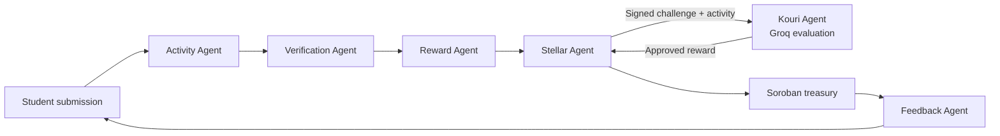
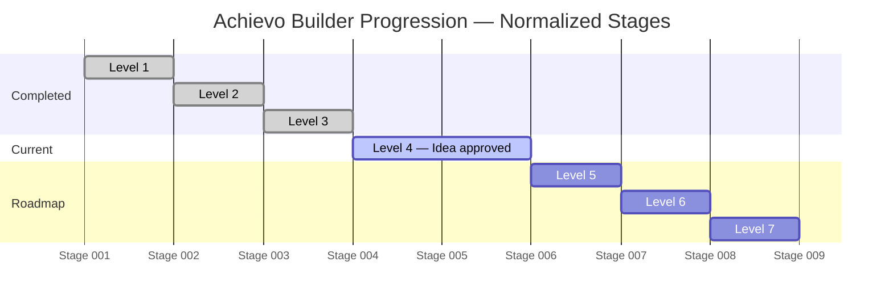

<p align="center">
  
</p>

<h1 align="center">Achievo</h1>

<p align="center">
  <strong>AI-powered academic rewards, settled transparently on Stellar.</strong>
</p>

<p align="center">
  Achievo turns verified student activities into testnet XLM rewards through wallet ownership proofs,
  server-side AI evaluation, and a Soroban treasury contract.
</p>

<p align="center">
  <a href="https://achievo-rust.vercel.app"><strong>Open Live App</strong></a>
  ·
  <a href="https://drive.google.com/file/d/1zDNqKgDn3rzbQ-2GhFv26RG4xjkEjxNd/view?usp=sharing"><strong>Watch Product Demo</strong></a>
  ·
  <a href="https://stellar.expert/explorer/testnet/contract/CDLRRHTNRQ2BGA7ESIXAMIQ2YNL3IF5PP5K6GPH2WR3IEYL7INMSCSNM"><strong>Verify Contract</strong></a>
</p>

<p align="center">
  
  
  
  
  
  
</p>

---

## Why Achievo

Student contributions such as tutoring, volunteering, workshops, events, and participation are valuable but often difficult to recognize consistently. Achievo provides a transparent reward flow:

1. A student connects a supported  wallet and describes an activity.
2. The student signs a nonce challenge to prove wallet ownership.
3. The server evaluates the submission with Groq and calculates an effort-based reward.
4. The server signs an admin-authorized `send_reward` call.
5. The Soroban treasury transfers testnet XLM and records an on-chain reward entry.
6. The UI displays the result, transaction hash, balance, history, and rank progress.

The admin secret remains server-side. A student wallet signs only the ownership challenge and receives rewards.

## Agent Pipeline

Achievo is **powered by Kouri** — a multi-agent evaluation stack where specialized agents handle parsing, verification, payout logic, settlement, and feedback. The **Kouri Agent** is the authoritative brain: every treasury payout is gated by its server-side decision.

### Kouri Agent — authoritative evaluator

The **Kouri Agent** runs server-side on Groq (`llama-3.1-8b-instant`) and is the single source of truth for reward eligibility and amount. After wallet ownership is proven, it:

- classifies the submission into tutoring, workshop, volunteering, event, or participation
- scores effort from `0.0` to `1.0` based on specificity, scope, impact, and detail
- computes the final XLM amount (`base_reward + effort_score × max_bonus`)
- returns a human-readable reason when a submission is rejected

Client-side agents drive the live pipeline UI, but **only the Kouri Agent decision authorizes treasury disbursement**.

### Specialist agents

| Agent | Responsibility | Runtime |
|---|---|---|
| **Activity Agent** | Parses free-form text into an activity type and reward hint | Client |
| **Verification Agent** | Validates the activity against the approved whitelist | Client |
| **Reward Agent** | Estimates the canonical XLM payout for a verified activity | Client |
| **Kouri Agent** | Issues the ownership challenge, collects the wallet signature, and submits the on-chain `send_reward` call | Client + server |
| **Feedback Agent** | Formats the blockchain result into a student-facing confirmation | Client |


```mermaid
flowchart LR
    Student[Student submission]
    A1[Activity Agent]
    A2[Verification Agent]
    A3[Reward Agent]
    Kouri[Kouri Agent<br/>Groq evaluation]
    A4[Stellar Agent]
    A5[Feedback Agent]
    Treasury[Soroban treasury]

    Student --> A1 --> A2 --> A3
    A3 --> A4
    A4 -->|Signed challenge + activity| Kouri
    Kouri -->|Approved reward| A4
    A4 --> Treasury
    Treasury --> A5 --> Student
```

Client agents live in `frontend/src/agents.ts`. Kouri Agent evaluation runs in `api/reward.ts`.

## Builder Progression

> Only progression status is published here. Challenge requirements, review criteria, and submission instructions are intentionally not reproduced.

| Level | Status |
|---|---|
| Level 1 | Approved and completed |
| Level 2 | Approved and completed |
| Level 3 | Approved and completed |
| Level 4 | **Current — idea approved, MVP progression in progress** |
| Level 5 | Upcoming |
| Level 6 | Upcoming |
| Level 7 | Upcoming |

The chart below is a **status-based sequence**, not a record of historical completion dates. Its dates are normalized only so GitHub can render the progression as a Mermaid Gantt chart.


```mermaid
gantt
    title Achievo Builder Progression — Normalized Stages
    dateFormat YYYY-MM-DD
    axisFormat Stage %j
    section Completed
    Level 1                         :done, level1, 2026-01-01, 1d
    Level 2                         :done, level2, after level1, 1d
    Level 3                         :done, level3, after level2, 1d
    section Current
    Level 4 — Idea approved         :active, level4, after level3, 2d
    section Roadmap
    Level 5                         :level5, after level4, 1d
    Level 6                         :level6, after level5, 1d
    Level 7                         :level7, after level6, 1d
```

## Product Screens

<p align="center">
  
  
  
  
</p>
<p align="center">
  
  
  
</p>

## System Architecture


```mermaid
flowchart TB
    Student[Student]

    subgraph browser [Student Browser]
        PWA[React 19 and Vite PWA]
        WalletKit[StellarWalletsKit]
        UIHints[Client pipeline hints]
        Analytics[PostHog analytics]
        PWA --> WalletKit
        PWA --> UIHints
        PWA --> Analytics
    end

    subgraph vercel [Vercel Serverless]
        NonceAPI[Nonce API]
        RewardAPI[Reward API]
        AdminSigner[Server-side admin signer]
        RewardAPI --> AdminSigner
    end

    subgraph services [External Services]
        Groq[Groq activity evaluation]
        Horizon[Stellar Horizon Testnet]
        SorobanRPC[Soroban RPC Testnet]
        PostHogCloud[PostHog Cloud]
    end

    subgraph stellar [Stellar Testnet]
        Treasury[RewardTreasuryContract]
        XlmSAC[XLM Stellar Asset Contract]
        History[Reward history and events]
        Treasury --> XlmSAC
        Treasury --> History
    end

    Student --> PWA
    Student -->|Select wallet and approve signature| WalletKit
    WalletKit -->|Address and signed transaction| PWA
    PWA -->|Request ownership challenge| NonceAPI
    NonceAPI -->|Build challenge transaction| Horizon
    PWA -->|Read wallet balance| Horizon
    PWA -->|Signed challenge and activity| RewardAPI
    RewardAPI -->|Classify and score| Groq
    AdminSigner -->|Submit send_reward| SorobanRPC
    SorobanRPC --> Treasury
    XlmSAC -->|Transfer testnet XLM| Student
    History --> SorobanRPC
    SorobanRPC -->|Return history and events| PWA
    Analytics --> PostHogCloud
```

### Responsibility boundaries

- **Client pipeline hints** provide immediate progress feedback; they are not authoritative AI decisions.
- **Groq on the server** classifies valid activities and scores submission effort.
- **Wallet ownership proof** uses an HMAC-protected nonce challenge signed by the connected wallet.
- **The server-side admin signer** authorizes treasury payouts; the admin key never enters browser code.
- **The Soroban contract** enforces positive payouts, available treasury balance, and a 20 XLM per-transaction ceiling.
- **The frontend** combines durable contract history with recent events and refreshes the payout feed every 15 seconds.

## Core Capabilities

- **Multi-wallet onboarding:** Freighter, Albedo, xBull, and Lobstr through StellarWalletsKit.
- **Effort-aware rewards:** Groq classifies activities and applies a quality multiplier to configured base rewards.
- **Verifiable payouts:** Every successful payout returns a transaction hash and emits a `reward.sent` event.
- **Durable contract history:** Reward recipient, amount, activity, ledger, and timestamp are stored on-chain.
- **Student progression:** XP, streaks, earnings, milestones, and animated scholar badges.
- **Responsive PWA:** Installable mobile experience with a cached app shell; network access is required for AI evaluation and Stellar operations.
- **Product analytics:** PostHog pageviews, autocapture, and core funnel events.
- **Automated quality gates:** GitHub Actions lint, test, and build the frontend and test/build the Soroban contract.

## Reward Model

```text
reward = base_reward + (effort_score × max_bonus)
```

| Activity | Base reward | Maximum bonus | Maximum total |
|---|---:|---:|---:|
| Tutoring | 5 XLM | 5 XLM | 10 XLM |
| Workshop | 2 XLM | 3 XLM | 5 XLM |
| Volunteering | 10 XLM | 5 XLM | 15 XLM |
| Event | 3 XLM | 2 XLM | 5 XLM |
| Participation | 3 XLM | 2 XLM | 5 XLM |

Effort is scored from `0.0` to `1.0` using specificity, duration or scope, impact, and concrete detail. The contract independently caps every payout at 20 XLM.

## Stellar Deployment

| Item | Value |
|---|---|
| Network | Stellar Testnet |
| Treasury contract | [`CDLRRHTN…NMSCSNM`](https://stellar.expert/explorer/testnet/contract/CDLRRHTNRQ2BGA7ESIXAMIQ2YNL3IF5PP5K6GPH2WR3IEYL7INMSCSNM) |
| XLM SAC | `CDLZFC3SYJYDZT7K67VZ75HPJVIEUVNIXF47ZG2FB2RMQQVU2HHGCYSC` |
| Sample transaction | [`f0649aba…9392ee35`](https://stellar.expert/explorer/testnet/tx/f0649abac4f597b6f2f7244f79e0ef4376a299573891034def5d16cc9392ee35) |

### Documented testnet QA activity

During the June 14–16, 2026 QA window, the repository documented **9 reward transactions totaling 69.6 testnet XLM across 2 wallets**. These are externally verifiable through the contract event log and linked accounts:

- [`GAWTHZ…GZGSED`](https://stellar.expert/explorer/testnet/account/GAWTHZQUA75JWE4KHZW434VS3WJ6ETFAOBR42A5TG7I2W7OVASGZGSED)
- [`GBL55A…NGE7KB5`](https://stellar.expert/explorer/testnet/account/GBL55A67ZYVI2VABOLPJEHKMNTYPPJHNT2KXN7ETVJXJHVXPXNGE7KB5)
- [Treasury contract event log](https://stellar.expert/explorer/testnet/contract/CDLRRHTNRQ2BGA7ESIXAMIQ2YNL3IF5PP5K6GPH2WR3IEYL7INMSCSNM)

## Analytics and Quality

Achievo initializes PostHog only when `VITE_POSTHOG_KEY` is configured. Local and CI builds work without analytics credentials.

| Event | Meaning |
|---|---|
| `wallet_connected` | A supported wallet connected successfully |
| `activity_submitted` | A student submitted an activity description |
| `reward_paid` | A reward settled and returned a transaction hash |

<p align="center">
  
</p>

Current automated coverage:

- **Frontend:** 8 Vitest files, 29 tests, including fast-check property tests.
- **Contract:** 18 Rust tests covering initialization, authorization, payout limits, storage, events, and failure states.
- **CI:** frontend lint/test/build plus contract test/release WASM build.

## Technology

| Layer | Implementation |
|---|---|
| Frontend | React 19, TypeScript, Vite 8, Tailwind CSS 4, Motion 12 |
| Wallets | StellarWalletsKit, Horizon Testnet, Friendbot |
| Backend | Vercel serverless TypeScript functions |
| AI | **Kouri Agent** on Groq `llama-3.1-8b-instant` |
| Smart contract | Rust, Soroban SDK 26.1, XLM SAC |
| Analytics | PostHog |
| Testing | Vitest, Testing Library, fast-check, Soroban test utilities |
| Deployment | Vercel and Stellar Testnet |

## Repository Map

```text
.
├── api/                         Vercel nonce and reward functions
├── contract/                    Soroban treasury contract, tests, deploy script
├── frontend/                    React and Vite production PWA
│   ├── public/                  PWA manifest, service worker, icons, avatars
│   └── src/                     UI, wallet integration, contract reads, tests
├── docs/
│   ├── screenshots/             README and evaluation screenshots
│   └── media/                   Demo source media and legacy presentation assets
├── scripts/                     Presentation and documentation utilities
├── tools/remotion-demo-video/   Isolated Remotion product-demo generator
├── vercel.json                  Production build and API routing
└── README.md                    Product, evidence, architecture, and setup
```

Production runtime is limited to `frontend/`, `api/`, the deployed contract, and external services. The Remotion project under `tools/` is development tooling used to produce the linked demo.

## Run Locally

### Prerequisites

- Node.js 24 and npm
- Vercel CLI
- A Stellar Testnet-compatible wallet
- Rust and the `wasm32v1-none` target only when building the contract

### Application

```bash
git clone https://github.com/TadeyRuk/Achievo.git
cd Achievo

npm install
npm --prefix frontend ci

# Pull configured variables if you have access to the Vercel project.
npx vercel env pull .env.local

# Or create .env.local manually using the variables below.
npx vercel dev
```

The local Vercel development server serves the frontend and `/api/*` functions together, normally at `http://localhost:3000`.

### Environment variables

| Variable | Required | Purpose |
|---|---|---|
| `ADMIN_SECRET` | Yes | Server-only Stellar secret for the treasury administrator |
| `GROQ_API_KEY` | Yes | Server-side activity evaluation |
| `NONCE_HMAC_SECRET` | Yes | Signs and validates wallet ownership challenges |
| `VITE_POSTHOG_KEY` | No | Public PostHog project key; analytics stays disabled when omitted |
| `VITE_POSTHOG_HOST` | No | PostHog ingestion host; defaults to `https://us.i.posthog.com` |

Never expose `ADMIN_SECRET`, `GROQ_API_KEY`, or `NONCE_HMAC_SECRET` through `VITE_*` variables or commit them to the repository.

## Test and Build

```bash
# Frontend
cd frontend
npm run lint
npm test
npm run build

# Contract
cd ../contract
cargo test
cargo build --release --target wasm32v1-none
```

The contract requires the `wasm32v1-none` target with Soroban SDK 26+.

## Demo Tooling

The product walkthrough is generated from the isolated Remotion project in [`tools/remotion-demo-video`](tools/remotion-demo-video/). It uses captured Achievo screens and synchronized narration without participating in the production runtime.

```bash
cd tools/remotion-demo-video
npm ci
npm run render:demo
```

## License

Released under the [MIT License](LICENSE).
