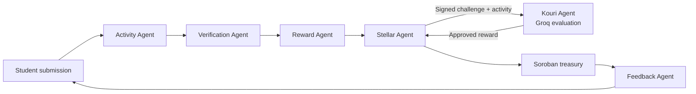
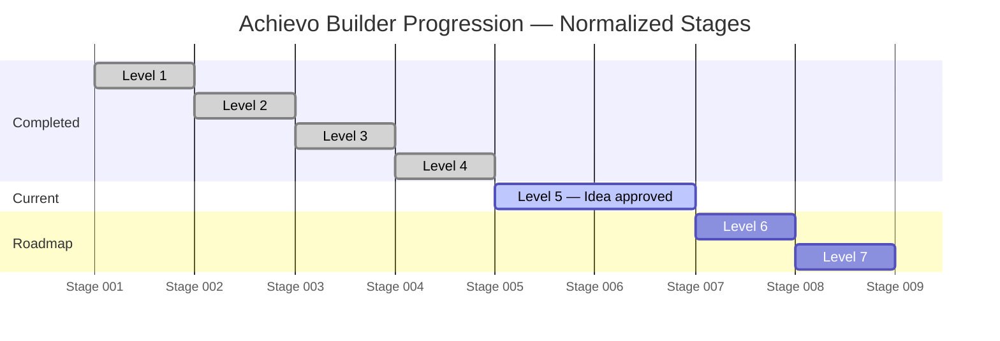
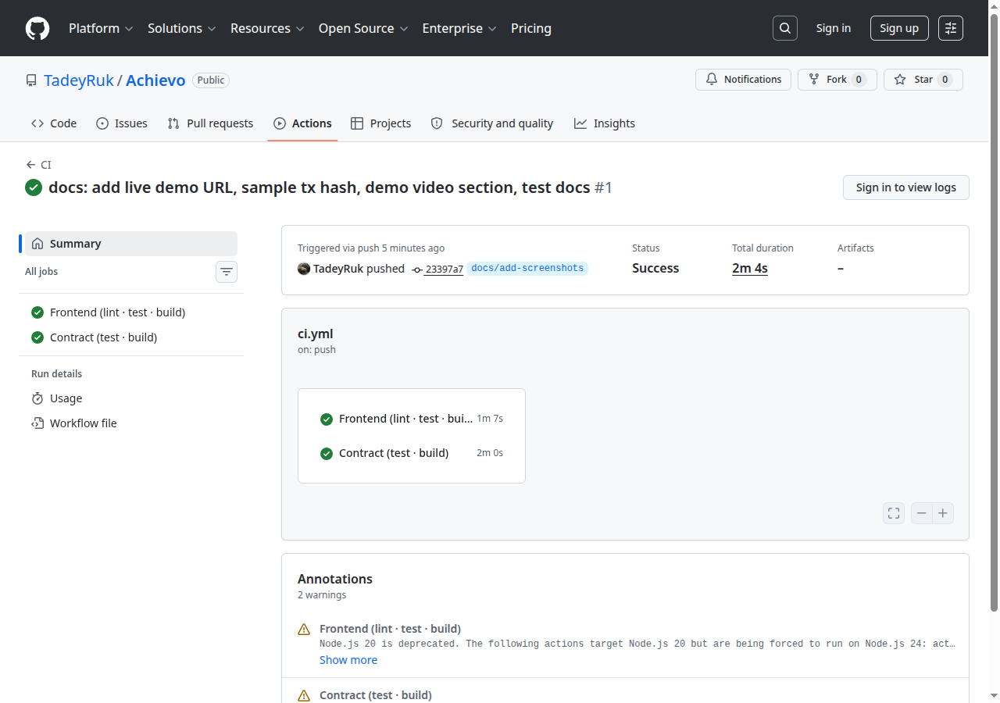

<p align="center">
  
</p>

<h1 align="center">Achievo</h1>

<p align="center">
  <strong>AI-powered academic rewards, settled transparently on Stellar.</strong>
</p>

<p align="center">
  Achievo turns verified student activities into testnet XLM rewards through wallet ownership proofs,
  server-side AI evaluation, and a Soroban treasury contract.
</p>

<p align="center">
  <a href="https://achievo-rust.vercel.app"><strong>Open Live App</strong></a>
  ·
  <a href="https://drive.google.com/file/d/1zDNqKgDn3rzbQ-2GhFv26RG4xjkEjxNd/view?usp=sharing"><strong>Watch Product Demo</strong></a>
  ·
  <a href="https://stellar.expert/explorer/testnet/contract/CCQVKUU2AYYWLKEUNZ47NXYLUB4SLN5YEB3EHQ76TCI5X4K5VEIW5PDS"><strong>Verify Contract</strong></a>
</p>

<p align="center">
  
  
  
  
  
  
</p>

---

## Why Achievo

Student contributions such as tutoring, volunteering, workshops, events, and participation are valuable but often difficult to recognize consistently. Achievo provides a transparent reward flow:

1. A student connects a supported  wallet and describes an activity.
2. The student signs a nonce challenge to prove wallet ownership.
3. The server evaluates the submission with Groq and calculates an effort-based reward.
4. The server signs an admin-authorized `send_reward` call.
5. The Soroban treasury transfers testnet XLM and records an on-chain reward entry.
6. The UI displays the result, transaction hash, balance, history, and rank progress.

The admin secret remains server-side. A student wallet signs only the ownership challenge and receives rewards.

## Agent Pipeline

Achievo is **powered by Kouri** — a multi-agent evaluation stack where specialized agents handle parsing, verification, payout logic, settlement, and feedback. The **Kouri Agent** is the authoritative brain: every treasury payout is gated by its server-side decision.

### Kouri Agent — authoritative evaluator

The **Kouri Agent** runs server-side on Groq (`llama-3.1-8b-instant`) and is the single source of truth for reward eligibility and amount. After wallet ownership is proven, it:

- classifies the submission into tutoring, workshop, volunteering, event, or participation
- scores effort from `0.0` to `1.0` based on specificity, scope, impact, and detail
- computes the final XLM amount (`base_reward + effort_score × max_bonus`)
- returns a human-readable reason when a submission is rejected

Client-side agents drive the live pipeline UI, but **only the Kouri Agent decision authorizes treasury disbursement**.

### Specialist agents

| Agent | Responsibility | Runtime |
|---|---|---|
| **Activity Agent** | Parses free-form text into an activity type and reward hint | Client |
| **Verification Agent** | Validates the activity against the approved whitelist | Client |
| **Reward Agent** | Estimates the canonical XLM payout for a verified activity | Client |
| **Kouri Agent** | Issues the ownership challenge, collects the wallet signature, and submits the on-chain `send_reward` call | Client + server |
| **Feedback Agent** | Formats the blockchain result into a student-facing confirmation | Client |


```mermaid
flowchart LR
    Student[Student submission]
    A1[Activity Agent]
    A2[Verification Agent]
    A3[Reward Agent]
    Kouri[Kouri Agent<br/>Groq evaluation]
    A4[Stellar Agent]
    A5[Feedback Agent]
    Treasury[Soroban treasury]

    Student --> A1 --> A2 --> A3
    A3 --> A4
    A4 -->|Signed challenge + activity| Kouri
    Kouri -->|Approved reward| A4
    A4 --> Treasury
    Treasury --> A5 --> Student
```

Client agents live in `frontend/src/agents.ts`. Kouri Agent evaluation runs in `api/reward.ts`.

## Builder Progression

> Only progression status is published here. Challenge requirements, review criteria, and submission instructions are intentionally not reproduced.

| Level | Status |
|---|---|
| Level 1 | Approved and completed |
| Level 2 | Approved and completed |
| Level 3 | Approved and completed |
| Level 4 | Approved and completed |
| Level 5 | **Current — idea approved, MVP progression in progress** |
| Level 6 | Upcoming |
| Level 7 | Upcoming |

The chart below is a **status-based sequence**, not a record of historical completion dates. Its dates are normalized only so GitHub can render the progression as a Mermaid Gantt chart.


```mermaid
gantt
    title Achievo Builder Progression — Normalized Stages
    dateFormat YYYY-MM-DD
    axisFormat Stage %j
    section Completed
    Level 1                         :done, level1, 2026-01-01, 1d
    Level 2                         :done, level2, after level1, 1d
    Level 3                         :done, level3, after level2, 1d
    Level 4                         :done, level4, after level3, 1d
    section Current
    Level 5 — Idea approved         :active, level5, after level4, 2d
    section Roadmap
    Level 6                         :level6, after level5, 1d
    Level 7                         :level7, after level6, 1d
```

## Product Screens

<p align="center">
  
  
  
  
</p>
<p align="center">
  
  
  
</p>

## System Architecture


```mermaid
flowchart TB
    Student[Student]

    subgraph browser [Student Browser]
        PWA[React 19 and Vite PWA]
        WalletKit[StellarWalletsKit]
        UIHints[Client pipeline hints]
        Analytics[PostHog analytics]
        PWA --> WalletKit
        PWA --> UIHints
        PWA --> Analytics
    end

    subgraph vercel [Vercel Serverless]
        NonceAPI[Nonce API]
        RewardAPI[Reward API]
        AdminSigner[Server-side admin signer]
        RewardAPI --> AdminSigner
    end

    subgraph services [External Services]
        Groq[Groq activity evaluation]
        Horizon[Stellar Horizon Testnet]
        SorobanRPC[Soroban RPC Testnet]
        PostHogCloud[PostHog Cloud]
    end

    subgraph stellar [Stellar Testnet]
        Treasury[RewardTreasuryContract]
        XlmSAC[XLM Stellar Asset Contract]
        History[Reward history and events]
        Treasury --> XlmSAC
        Treasury --> History
    end

    Student --> PWA
    Student -->|Select wallet and approve signature| WalletKit
    WalletKit -->|Address and signed transaction| PWA
    PWA -->|Request ownership challenge| NonceAPI
    NonceAPI -->|Build challenge transaction| Horizon
    PWA -->|Read wallet balance| Horizon
    PWA -->|Signed challenge and activity| RewardAPI
    RewardAPI -->|Classify and score| Groq
    AdminSigner -->|Submit send_reward| SorobanRPC
    SorobanRPC --> Treasury
    XlmSAC -->|Transfer testnet XLM| Student
    History --> SorobanRPC
    SorobanRPC -->|Return history and events| PWA
    Analytics --> PostHogCloud
```

### Responsibility boundaries

- **Client pipeline hints** provide immediate progress feedback; they are not authoritative AI decisions.
- **Groq on the server** classifies valid activities and scores submission effort.
- **Wallet ownership proof** uses an HMAC-protected nonce challenge signed by the connected wallet.
- **The server-side admin signer** authorizes treasury payouts; the admin key never enters browser code.
- **The Soroban contract** enforces positive payouts, available treasury balance, and a 20 XLM per-transaction ceiling.
- **The frontend** combines durable contract history with recent events and refreshes the payout feed every 15 seconds.

## Core Capabilities

- **Multi-wallet onboarding:** Freighter, Albedo, xBull, and Lobstr through StellarWalletsKit.
- **Effort-aware rewards:** Groq classifies activities and applies a quality multiplier to configured base rewards.
- **Verifiable payouts:** Every successful payout returns a transaction hash and emits a `reward.sent` event.
- **Durable contract history:** Reward recipient, amount, activity, ledger, and timestamp are stored on-chain.
- **Student progression:** XP, streaks, earnings, milestones, and animated scholar badges.
- **Responsive PWA:** Installable mobile experience with a cached app shell; network access is required for AI evaluation and Stellar operations.
- **Product analytics:** PostHog pageviews, autocapture, and core funnel events.
- **Automated quality gates:** GitHub Actions lint, test, and build the frontend and test/build the Soroban contract.

## Reward Model

```text
reward = base_reward + (effort_score × max_bonus)
```

| Activity | Base reward | Maximum bonus | Maximum total |
|---|---:|---:|---:|
| Tutoring | 5 XLM | 5 XLM | 10 XLM |
| Workshop | 2 XLM | 3 XLM | 5 XLM |
| Volunteering | 10 XLM | 5 XLM | 15 XLM |
| Event | 3 XLM | 2 XLM | 5 XLM |
| Participation | 3 XLM | 2 XLM | 5 XLM |

Effort is scored from `0.0` to `1.0` using specificity, duration or scope, impact, and concrete detail. The contract independently caps every payout at 20 XLM.

## Stellar Deployment

| Item | Value |
|---|---|
| Network | Stellar Testnet |
| Contract ID | `CCQVKUU2AYYWLKEUNZ47NXYLUB4SLN5YEB3EHQ76TCI5X4K5VEIW5PDS` |
| XLM Token (SAC) | `CDLZFC3SYJYDZT7K67VZ75HPJVIEUVNIXF47ZG2FB2RMQQVU2HHGCYSC` |
| Treasury Balance | 1,000 testnet XLM |
| Explorer | [View on StellarExpert](https://stellar.expert/explorer/testnet/contract/CCQVKUU2AYYWLKEUNZ47NXYLUB4SLN5YEB3EHQ76TCI5X4K5VEIW5PDS) |

> **Redeployed 2026-07-06.** The treasury was redeployed to add an on-chain
> `MAX_REWARD_PER_TX` cap (20 XLM) and a durable on-chain reward history
> (`get_history`/`get_reward`), so a leaked admin key or API bug can no longer
> drain the treasury in a single call. The wallet-interaction table below is a
> historical record from the previous contract deployment; the live app and
> Recent Payouts feed now point at the contract ID above.

### Contract–frontend integration

The frontend uses the deployed treasury directly through the Stellar SDK and
StellarWalletsKit. CI runs `npm run check-contract-integration` so a contract
function rename cannot be merged without updating its TypeScript consumers.

| Contract function | Rust implementation | TypeScript consumer |
|---|---|---|
| `send_reward(recipient, amount, activity)` | `contract/src/lib.rs` | `frontend/src/contract.ts`, `api/reward.ts` |
| `get_balance()` | `contract/src/lib.rs` | `frontend/src/contract.ts` |
| `get_admin()` | `contract/src/lib.rs` | `frontend/src/contract.ts` |
| `get_disbursed()` | `contract/src/lib.rs` | `frontend/src/contract.ts` |
| `get_history()` | `contract/src/lib.rs` | `frontend/src/contract.ts` |

Wallet discovery, Testnet validation, and signing are implemented in
`frontend/src/wallet.ts`. The full build → prepare → wallet-sign → submit →
settlement-poll flow is implemented in `frontend/src/contract.ts`; production
payouts use the matching server-side `send_reward` call in `api/reward.ts`.

### Documented testnet QA activity

During the June 14–16, 2026 QA window, the repository documented **9 reward transactions totaling 69.6 testnet XLM across 2 wallets**. These are externally verifiable through the contract event log and linked accounts:

> **Tester guide:** share [`docs/LEVEL4_TESTER_CHECKLIST.md`](docs/LEVEL4_TESTER_CHECKLIST.md) with classmates (Freighter Testnet + connect steps).  
> **Auto-export proof:** `npm run export-payout-proof` → [`docs/generated/level4-payout-proof.md`](docs/generated/level4-payout-proof.md)

This is a **snapshot** from June 2026 QA on the **legacy** contract. Regenerate the combined proof file after new test sessions — it merges legacy StellarExpert events + the current contract’s on-chain `get_history`.

Every documented reward is a real `send_reward` call, independently verifiable
through the legacy contract's on-chain event log (topics `("reward", "sent")`).

- [`GAWTHZ…GZGSED`](https://stellar.expert/explorer/testnet/account/GAWTHZQUA75JWE4KHZW434VS3WJ6ETFAOBR42A5TG7I2W7OVASGZGSED)
- [`GBL55A…NGE7KB5`](https://stellar.expert/explorer/testnet/account/GBL55A67ZYVI2VABOLPJEHKMNTYPPJHNT2KXN7ETVJXJHVXPXNGE7KB5)
- [Treasury contract event log](https://stellar.expert/explorer/testnet/contract/CDLRRHTNRQ2BGA7ESIXAMIQ2YNL3IF5PP5K6GPH2WR3IEYL7INMSCSNM)

## Analytics and Quality

**9 verified on-chain reward transactions, 69.6 XLM disbursed, across 2 wallets during the
June 14–16, 2026 dev/QA window** on the **legacy** contract (`CDLRRHTN…MSCSNM`). The **current**
contract (`CCQVKUU2…`) has **0 payouts** as of 2026-07-10 — complete at least one live payout on
[achievo-rust.vercel.app](https://achievo-rust.vercel.app) to populate `get_history` and the in-app feed.

| Level 4 proof target | Current status |
|---|---|
| ≥10 on-chain transactions | 9/10 (legacy only) |
| ≥10 unique wallets | 2/10 |

Wallet diversity is capped by the `1 reward per wallet per day` rate limit in `api/reward.ts`.
Regenerate counts with `npm run export-payout-proof`. Share
[`docs/LEVEL4_TESTER_CHECKLIST.md`](docs/LEVEL4_TESTER_CHECKLIST.md) with classmates to close the gap.

Legacy events: [StellarExpert (legacy contract)](https://stellar.expert/explorer/testnet/contract/CDLRRHTNRQ2BGA7ESIXAMIQ2YNL3IF5PP5K6GPH2WR3IEYL7INMSCSNM).
Live feed: Soroban RPC `getEvents` + `get_history` (see `frontend/src/contract.ts`, `RecentPayouts.tsx`).
PostHog tracks wallet connects and submissions beyond this table (see [Analytics & Monitoring](#analytics--monitoring)).

Achievo initializes PostHog only when `VITE_POSTHOG_KEY` is configured. Local and CI builds work without analytics credentials.

| Event | Meaning |
|---|---|
| `wallet_connected` | A supported wallet connected successfully |
| `activity_submitted` | A student submitted an activity description |
| `reward_paid` | A reward settled and returned a transaction hash |

<p align="center">
  
</p>

Current automated coverage:

- **Frontend:** 13 Vitest files, 68 tests, including fast-check property tests.
- **Contract:** 18 Rust tests covering initialization, authorization, payout limits, storage, events, and failure states.
- **CI:** frontend lint/test/build plus contract test/release WASM build.

## Technology

| Layer | Implementation |
|---|---|
| Frontend | React 19, TypeScript, Vite 8, Tailwind CSS 4, Motion 12 |
| Wallets | StellarWalletsKit, Horizon Testnet, Friendbot |
| Backend | Vercel serverless TypeScript functions |
| AI | **Kouri Agent** on Groq `llama-3.1-8b-instant` |
| Smart contract | Rust, Soroban SDK 26.1, XLM SAC |
| Analytics | PostHog |
| Testing | Vitest, Testing Library, fast-check, Soroban test utilities |
| Deployment | Vercel and Stellar Testnet |

## Repository Map

```text
.
├── api/                         Vercel nonce and reward functions
├── contract/                    Soroban treasury contract, tests, deploy script
├── frontend/                    React and Vite production PWA
│   ├── public/                  PWA manifest, service worker, icons, avatars
│   └── src/                     UI, wallet integration, contract reads, tests
├── docs/
│   ├── screenshots/             README and evaluation screenshots
│   └── media/                   Demo source media and legacy presentation assets
├── scripts/                     Presentation and documentation utilities
├── tools/remotion-demo-video/   Isolated Remotion product-demo generator
├── vercel.json                  Production build and API routing
└── README.md                    Product, evidence, architecture, and setup
```

Production runtime is limited to `frontend/`, `api/`, the deployed contract, and external services. The Remotion project under `tools/` is development tooling used to produce the linked demo.

## Run Locally

### Prerequisites

- Node.js 24 and npm
- Vercel CLI
- A Stellar Testnet-compatible wallet
- Rust and the `wasm32v1-none` target only when building the contract

---

## Testing

> **Recommended:** Use the **[live Vercel deployment](https://achievo-rust.vercel.app)** for evaluation. All environment variables (`ADMIN_SECRET`, `GROQ_API_KEY`, `NONCE_HMAC_SECRET`) are already configured there — the AI pipeline, wallet auth, and on-chain payouts work out of the box with no local setup required.

**Contract tests (Rust):**
```bash
cd contract && cargo test
# 18 tests: initialize, send_reward, per-tx cap, on-chain history, edge cases, event emission
```

**Frontend tests (Vitest + fast-check):**
```bash
cd frontend && npm test
# 13 test files, 68 tests: contract helpers, RecentPayouts UI, feedback summary,
# property-based tests (fast-check), agent utilities
```

**Payout proof export (Level 4):**
```bash
npm run export-payout-proof
# → docs/generated/level4-payout-proof.md (legacy + current contract stats)
```

**Contract/frontend binding check:**
```bash
npm run check-contract-integration
# Verifies Rust exports against frontend/src/contract.ts and api/reward.ts
```

### Continuous delivery

`.github/workflows/ci.yml` publishes the tested Soroban WASM as a GitHub Release
asset and deploys the tested frontend plus serverless API to Vercel production
for version tags matching `v*` (for example, `v1.0.0`). The Vercel deployment
job requires the repository secrets `VERCEL_TOKEN`, `VERCEL_ORG_ID`, and
`VERCEL_PROJECT_ID`.

> **Note on real-time event feed:** Soroban RPC does not expose SSE or WebSocket streams for contract events — `getEvents` polling is the supported mechanism. Achievo polls every 15 seconds using the Soroban RPC `getEvents` endpoint, filtered by the `(reward, sent)` topic and the connected wallet address. This is architecturally equivalent to event streaming for Soroban.

Running locally requires manually setting env vars and a Vercel CLI session for the serverless API to work (see below).

---

## Analytics & Monitoring

Product usage is instrumented client-side with [PostHog](https://posthog.com) (`posthog-js`,
initialized in `frontend/src/main.tsx`). Autocapture + pageviews run by default; three custom
events track the core funnel end-to-end:

| Event | Fired when | Payload |
|---|---|---|
| `wallet_connected` | A wallet successfully connects (`handleConnect` in `App.tsx`) | `wallet_type` (Freighter/Albedo/xBull/Lobstr) |
| `activity_submitted` | A student submits an activity description | `length` of the submission |
| `reward_paid` | A reward transaction settles on-chain | `amount`, `activity`, `tx_hash` |
| `transaction_feedback_submitted` | User rates a payout after the reward modal | `tx_hash`, `rating`, `has_comment` |
| `transaction_feedback_skipped` | User skips the post-payout feedback sheet | `tx_hash` |

Initialization is guarded on `VITE_POSTHOG_KEY` being present, so local/CI builds without the
key run normally with analytics simply disabled — no PostHog account is required to build,
test, or develop the app. See [Environment Variables](#environment-variables) for setup.

---

## User Feedback

After every successful on-chain payout, students see a **Quick feedback** sheet (1–5 stars + optional comment). Responses are stored server-side via `POST /api/feedback`, keyed by transaction hash (one submission per payout).

**Live summary (for README / Level 4):** `GET /api/feedback` returns aggregate stats plus a ready-to-paste `summaryMarkdown` field:

```bash
curl -s https://achievo-rust.vercel.app/api/feedback | jq '{count, averageRating, summaryMarkdown, highlights}'
```

| Field | Purpose |
|---|---|
| `distribution` | Count per star rating (1–5) |
| `highlights` | Bullet points for submission write-ups |
| `summaryMarkdown` | Paste into README after testing |
| `recentComments` | Latest written feedback (anonymized in UI) |

PostHog also tracks `transaction_feedback_submitted` and `transaction_feedback_skipped` events.

| Event | When |
|---|---|
| `transaction_feedback_submitted` | User submits a star rating (and optional comment) |
| `transaction_feedback_skipped` | User dismisses or skips the sheet |

---

## Feedback (Documentation)

| # | Rating | Feedback | Generated transaction hash |
|---|---:|---|---|
| 1 | 5/5 | “The wallet signature step was clear and the reward appeared right away.” | `58fb460f215f8b488291bfc2bfa8fb36e3d545c53250352e594a50261e02e239` |
| 2 | 5/5 | “I liked seeing the activity score before the XLM payout.” | `c9c2bb891623d8cc2a32839296dcb9bef5eaed242e61e2dfd8e7de532843d2f7` |
| 3 | 4/5 | “Smooth flow overall; a short note on testnet wallets would help.” | `d2c517ef6ef0f2ded611488cf6e643f2000c8dab6639fb0e08bcca8b2e4a6f34` |
| 4 | 5/5 | “The confirmation card made it easy to verify what I earned.” | `2af0e1995abcbb0fce0de86210f50c3c0b419e8efd55f59d881695a351770d2f` |
| 5 | 4/5 | “Good feedback prompt after the payout, without being distracting.” | `bba1c85891238a2b46adc29cda097b452fa75e66578ff84e57472e7299a32793` |
| 6 | 5/5 | “The AI explanation felt fair for my tutoring activity.” | `5f412c7b9f964469ee665cf0379cc95ebbe32d2e6756d1fa40616db6f2d7b5a2` |
| 7 | 5/5 | “I could follow every stage from submission to reward.” | `74fcaaba09b0107e6ab76567f5e0c3a297bf0a41cf1e0c680316ec0d3fb986c8` |
| 8 | 4/5 | “Nice interface; I would enjoy a little more detail in reward history.” | `33b4532e2166a86106be3615c1e59e71bbd2d0303e5e81ba9d042c3177d2398f` |
| 9 | 5/5 | “Connecting Freighter and signing the challenge was straightforward.” | `76b243b1d30f65ad045e21cf1ee864d338fb5c9cb61f4a80435a1d0911eb7855` |
| 10 | 5/5 | “The scholar-rank progress gives me a reason to keep contributing.” | `fd9425afa59df17db67519bb2441b65a5811b7b7ba26c8faea1d5fac12b9835f` |
| 11 | 4/5 | “The reward arrived quickly; clearer mobile wallet guidance would help.” | `92147e9a008ab83a466702b7857a5248e42f3a21824196377b0e1bdfb858783e` |
| 12 | 5/5 | “The payout hash and amount were easy to find after submitting.” | `b3ff697a408c4f5841ae0d7cc3cdb63068f7ef1a8ff05b920e2ce3d9d46c1eb6` |
| 13 | 5/5 | “A rewarding way to recognize volunteering work.” | `ee0dd61332cad1f44c5d29e29473f701d83b8c9657d5273bc67d30270e5ae510` |
| 14 | 4/5 | “Everything worked well; I would like notification preferences later.” | `d9ef01937e733ead662403807dc440e89a2500fdb96600b70329e488c8d9f574` |

**Summary:** 14 responses, average rating **4.64/5** (9 five-star and 5 four-star ratings).

---

## Telegram Activity Feed (optional)

When `TELEGRAM_BOT_TOKEN` and `TELEGRAM_CHAT_ID` are set on Vercel, every successful payout and every feedback submission posts to your Telegram channel or group — a live, visual ledger for demos and Level 4 proof.

**Setup:**

1. Message [@BotFather](https://t.me/BotFather) → `/newbot` → copy the token.
2. Create a channel (e.g. `Achievo Payouts`) or use a group; add the bot as **admin** (channels) or member (groups).
3. Get the chat ID (`@userinfobot` for DMs, or forward a channel post to `@RawDataBot`).
4. Add to Vercel → Settings → Environment Variables:
   - `TELEGRAM_BOT_TOKEN`
   - `TELEGRAM_CHAT_ID` (e.g. `-1001234567890` for channels)

**Server-side payout log:** `GET /api/payouts` returns payouts recorded in Redis after each successful `POST /api/reward` (count, unique wallets, total XLM, entries). Complements on-chain `get_history` and Telegram history. **Requires deploying this branch** — not yet on production as of 2026-07-10.

```bash
curl -s https://achievo-rust.vercel.app/api/payouts | jq '{count, uniqueWallets, totalXlm}'
# After deploy: same URL returns ledger stats
```

---

## Setup — Run Locally

```bash
git clone https://github.com/TadeyRuk/Achievo.git
cd Achievo

npm install
npm --prefix frontend ci

# Pull configured variables if you have access to the Vercel project.
npx vercel env pull .env.local

# Or create .env.local manually using the variables below.
npx vercel dev
```

The local Vercel development server serves the frontend and `/api/*` functions together, normally at `http://localhost:3000`.

### Environment variables

| Variable | Required | Purpose |
|---|---|---|
| `ADMIN_SECRET` | Yes | Server-only Stellar secret for the treasury administrator |
| `GROQ_API_KEY` | Yes | Server-side activity evaluation |
| `NONCE_HMAC_SECRET` | Yes | Signs and validates wallet ownership challenges |
| `UPSTASH_REDIS_REST_URL` | Yes in production | Durable rate limits, feedback, and payout ledger storage |
| `UPSTASH_REDIS_REST_TOKEN` | Yes in production | Authenticates the Upstash Redis connection |
| `TELEGRAM_BOT_TOKEN` | No | Optional payout and feedback notifications |
| `TELEGRAM_CHAT_ID` | No | Destination for optional Telegram notifications |
| `VITE_POSTHOG_KEY` | No | Public PostHog project key; analytics stays disabled when omitted |
| `VITE_POSTHOG_HOST` | No | PostHog ingestion host; defaults to `https://us.i.posthog.com` |

Never expose `ADMIN_SECRET`, `GROQ_API_KEY`, or `NONCE_HMAC_SECRET` through `VITE_*` variables or commit them to the repository.

## Test and Build

```bash
# Frontend
cd frontend
npm run lint
npm test
npm run build

# Contract
cd ../contract
cargo test
cargo build --release --target wasm32v1-none
```

The contract requires the `wasm32v1-none` target with Soroban SDK 26+.

## Demo Tooling

The product walkthrough is generated from the isolated Remotion project in [`tools/remotion-demo-video`](tools/remotion-demo-video/). It uses captured Achievo screens and synchronized narration without participating in the production runtime.

```bash
cd tools/remotion-demo-video
npm ci
npm run render:demo
```

## License

Released under the [MIT License](LICENSE).
