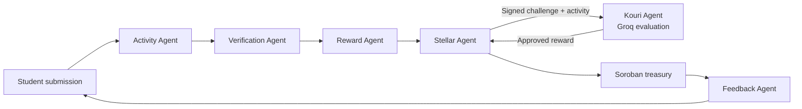
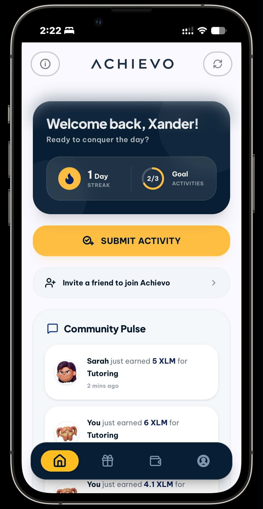
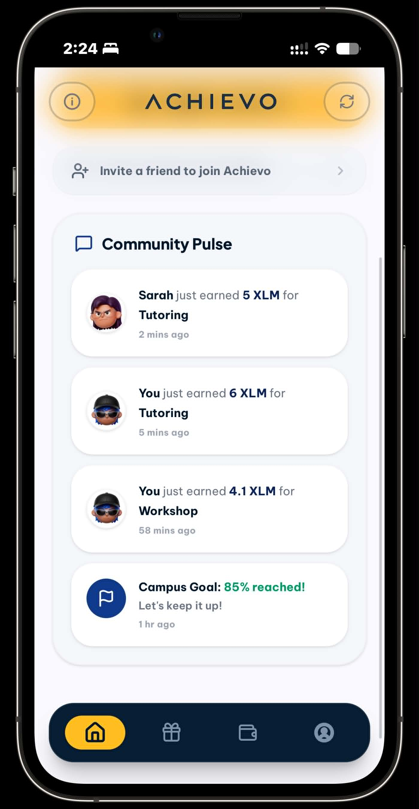
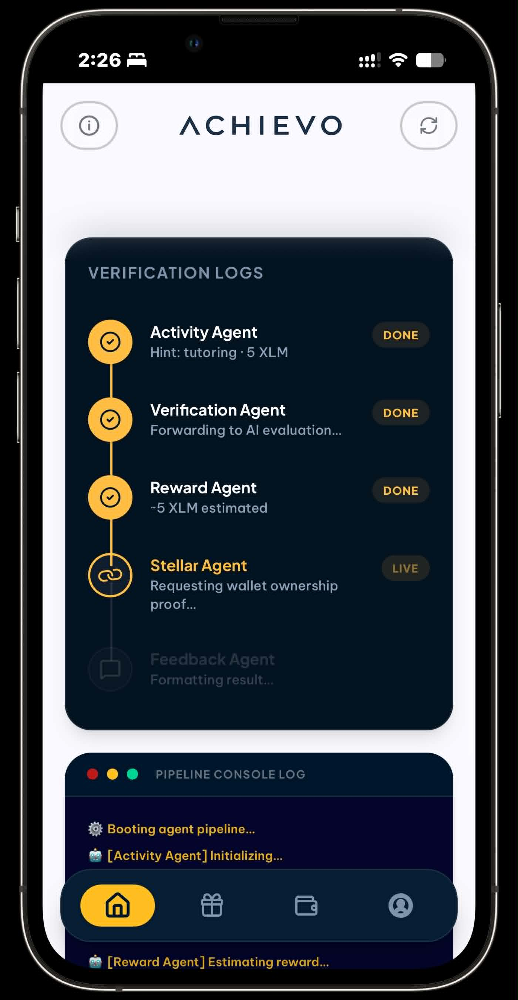
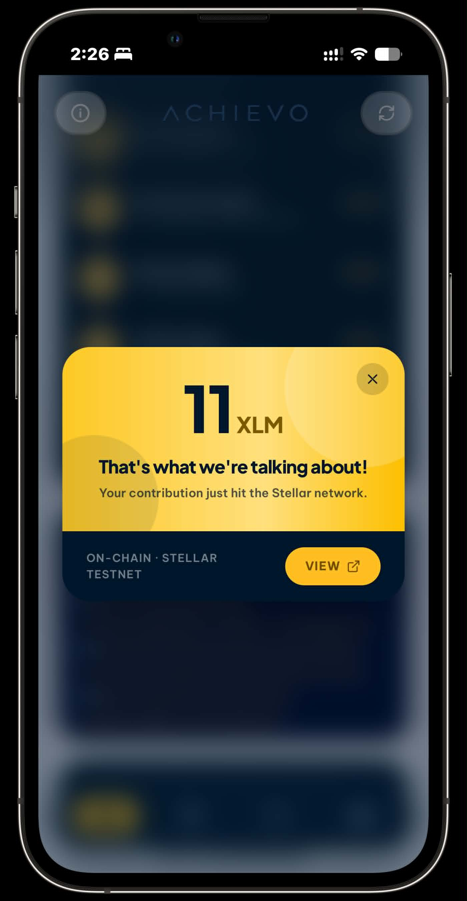
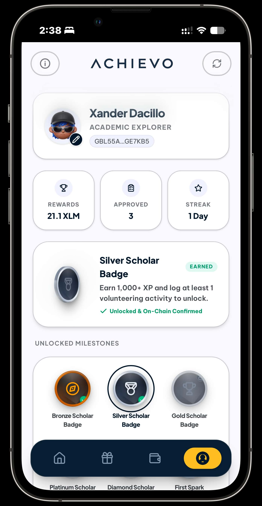
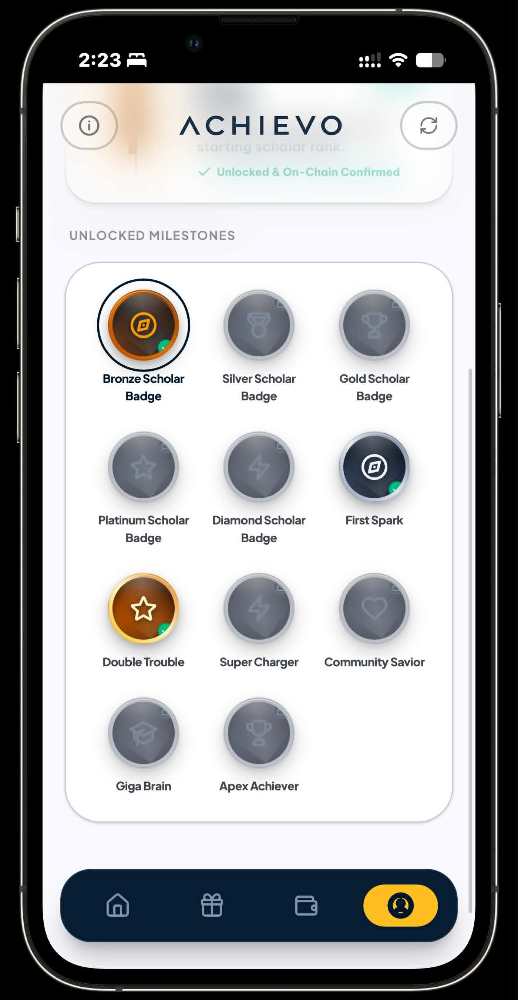
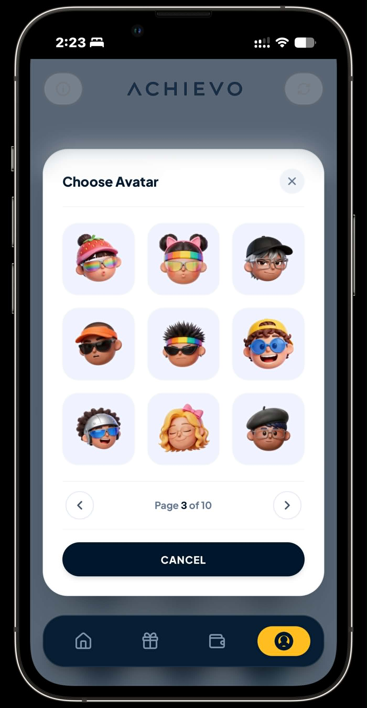
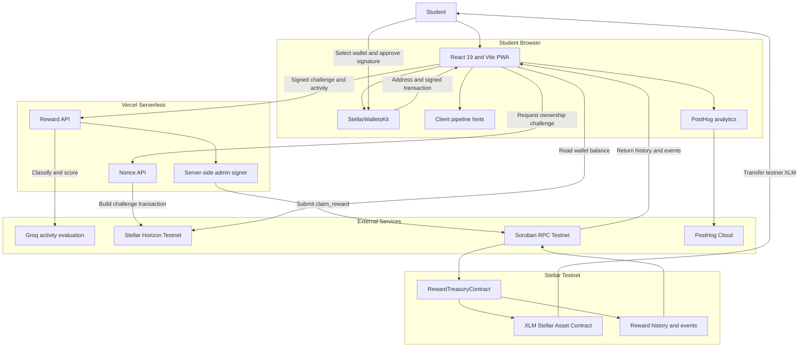

<p align="center">
  
</p>

<h1 align="center">Achievo</h1>

<p align="center">
  <strong>AI-powered academic rewards, settled transparently on Stellar.</strong>
</p>

<p align="center">
  Achievo turns verified student activities into testnet XLM rewards through wallet ownership proofs,
  server-side AI evaluation, and a Soroban treasury contract.
</p>

<p align="center">
  <a href="https://achievo-rust.vercel.app"><strong>Open Live App</strong></a>
  ·
  <a href="https://drive.google.com/file/d/1zDNqKgDn3rzbQ-2GhFv26RG4xjkEjxNd/view?usp=sharing"><strong>Watch Product Demo</strong></a>
  ·
  <a href="https://stellar.expert/explorer/testnet/contract/CCQVKUU2AYYWLKEUNZ47NXYLUB4SLN5YEB3EHQ76TCI5X4K5VEIW5PDS"><strong>Verify Contract</strong></a>
</p>

<p align="center">
  
  
  
  
  
  
  
</p>

---

## Why Achievo

Student contributions such as tutoring, volunteering, workshops, events, and participation are valuable but often difficult to recognize consistently. Achievo provides a transparent reward flow:

1. A student connects a supported wallet and describes an activity.
2. The student completes SEP-10 Web Auth (signs a challenge, receives a JWT).
3. The server evaluates the submission with Groq and calculates an effort-based reward.
4. The server mints an attestor voucher and relays `claim_reward` on-chain.
5. The Soroban treasury transfers XLM and records an on-chain reward entry.
6. The UI displays the result, transaction hash, balance, history, and rank progress.

Treasury and SEP-10 secrets remain server-side. A student wallet signs only the Web Auth challenge and receives rewards.

## How It Works — Agent Pipeline

Achievo is **powered by Kouri** — a multi-agent evaluation stack where specialized agents handle parsing, verification, payout logic, settlement, and feedback. The **Kouri Agent** is the authoritative brain: every treasury payout is gated by its server-side decision.

| Agent | Responsibility | Runtime |
|---|---|---|
| **Activity Agent** | Parses free-form text into an activity type and reward hint | Client |
| **Verification Agent** | Validates the activity against the approved whitelist | Client |
| **Reward Agent** | Estimates the canonical XLM payout for a verified activity | Client |
| **Kouri Agent** | Issues the ownership challenge, collects the wallet signature, mints a voucher, and relays on-chain `claim_reward` — the **only** decision that authorizes disbursement | Client + server |
| **Feedback Agent** | Formats the blockchain result into a student-facing confirmation | Client |


```mermaid
flowchart LR
    Student[Student submission]
    A1[Activity Agent]
    A2[Verification Agent]
    A3[Reward Agent]
    Kouri[Kouri Agent<br/>Groq evaluation]
    A4[Stellar Agent]
    A5[Feedback Agent]
    Treasury[Soroban treasury]

    Student --> A1 --> A2 --> A3
    A3 --> A4
    A4 -->|Signed challenge + activity| Kouri
    Kouri -->|Approved reward| A4
    A4 --> Treasury
    Treasury --> A5 --> Student
```

Client agents live in the earn feature. Kouri Agent evaluation runs server-side (Groq
`llama-3.1-8b-instant`) behind the thin `api/reward.ts` Vercel adapter — it classifies the
activity, scores effort `0.0`–`1.0`, and computes `base_reward + effort_score × max_bonus`.

## Product Screens

<p align="center">
  
  
  
  
</p>
<p align="center">
  
  
  
</p>

## System Architecture


```mermaid
flowchart TB
    Student[Student]

    subgraph browser [Student Browser]
        PWA[React 19 and Vite PWA]
        WalletKit[StellarWalletsKit]
        UIHints[Client pipeline hints]
        Analytics[PostHog analytics]
        PWA --> WalletKit
        PWA --> UIHints
        PWA --> Analytics
    end

    subgraph vercel [Vercel Serverless]
        NonceAPI[Nonce API]
        RewardAPI[Reward API]
        AdminSigner[Server-side admin signer]
        RewardAPI --> AdminSigner
    end

    subgraph services [External Services]
        Groq[Groq activity evaluation]
        Horizon[Stellar Horizon Testnet]
        SorobanRPC[Soroban RPC Testnet]
        PostHogCloud[PostHog Cloud]
    end

    subgraph stellar [Stellar Testnet]
        Treasury[RewardTreasuryContract]
        XlmSAC[XLM Stellar Asset Contract]
        History[Reward history and events]
        Treasury --> XlmSAC
        Treasury --> History
    end

    Student --> PWA
    Student -->|Select wallet and approve signature| WalletKit
    WalletKit -->|Address and signed transaction| PWA
    PWA -->|Request ownership challenge| NonceAPI
    NonceAPI -->|Build challenge transaction| Horizon
    PWA -->|Read wallet balance| Horizon
    PWA -->|Signed challenge and activity| RewardAPI
    RewardAPI -->|Classify and score| Groq
    AdminSigner -->|Submit claim_reward| SorobanRPC
    SorobanRPC --> Treasury
    XlmSAC -->|Transfer testnet XLM| Student
    History --> SorobanRPC
    SorobanRPC -->|Return history and events| PWA
    Analytics --> PostHogCloud
```

### Responsibility boundaries

- **Client pipeline hints** provide immediate progress feedback; they are not authoritative AI decisions.
- **`@achievo/sdk`** is the only browser path to `/api/*`; feature UI never owns raw fetch/XDR transport.
- **Groq on the server** classifies valid activities and scores submission effort.
- **Wallet ownership proof** uses SEP-10 Web Auth (`/.well-known/stellar.toml` + `/api/web-auth`) and a Bearer JWT on `/api/reward`.
- **The server-side admin signer** authorizes treasury payouts; the admin key never enters browser code.
- **API handlers** are thin Vercel adapters; use cases live under `api/_server/features` with ports wired in composition.
- **The Soroban contract** enforces positive payouts, available treasury balance, and a 20 XLM per-transaction ceiling.
- **The frontend** combines durable contract history with recent events and refreshes the payout feed every 15 seconds.
- **CI** (`.github/workflows/ci.yml`) builds `@achievo/*` packages, runs `npm run check:boundaries`, the contract/frontend binding check, frontend lint/test/build, and contract test + release WASM.

## Reward Model

```text
reward = base_reward + (effort_score × max_bonus)
```

| Activity | Base reward | Maximum bonus | Maximum total |
|---|---:|---:|---:|
| Tutoring | 5 XLM | 5 XLM | 10 XLM |
| Workshop | 2 XLM | 3 XLM | 5 XLM |
| Volunteering | 10 XLM | 5 XLM | 15 XLM |
| Event | 3 XLM | 2 XLM | 5 XLM |
| Participation | 3 XLM | 2 XLM | 5 XLM |

Effort is scored from `0.0` to `1.0` using specificity, duration or scope, impact, and concrete detail. The contract independently caps every payout at 20 XLM.

### Activity Types

- **Tutoring** — one student teaching or coaching another (subject help, exam prep, peer-led study sessions). Highest base reward since it requires the most sustained, direct effort.
- **Workshop** — leading or organizing a hands-on skills session (coding workshop, seminar, training). Lower base reward but rewards well-documented, high-effort submissions.
- **Volunteering** — unpaid community or campus service (event staffing, outreach, cleanup drives). Highest total reward, reflecting its outsized impact on the community.
- **Event** — attending or helping run an official school/club event (competitions, fairs, guest talks).
- **Participation** — general engagement in class or club activities that doesn't fit the categories above (discussions, small contributions, attendance-based effort).

Each submission is free-form text; the Groq classifier (`api/reward.ts`) maps it to one of these five types and assigns the effort score before the reward formula runs.

## Stellar Deployment

| Item | Value |
|---|---|
| Network | Stellar Testnet |
| Contract ID | `CCQVKUU2AYYWLKEUNZ47NXYLUB4SLN5YEB3EHQ76TCI5X4K5VEIW5PDS` |
| XLM Token (SAC) | `CDLZFC3SYJYDZT7K67VZ75HPJVIEUVNIXF47ZG2FB2RMQQVU2HHGCYSC` |
| Treasury Balance | 1,000 testnet XLM |
| Explorer | [View on StellarExpert](https://stellar.expert/explorer/testnet/contract/CCQVKUU2AYYWLKEUNZ47NXYLUB4SLN5YEB3EHQ76TCI5X4K5VEIW5PDS) |

> **Redeployed 2026-07-06** to add an on-chain `MAX_REWARD_PER_TX` cap (20 XLM) and durable
> on-chain reward history (`get_history`/`get_reward`). The live app and Recent Payouts feed
> point at the contract ID above.

**Contract–frontend integration:** the frontend calls the deployed treasury directly through
the Stellar SDK and StellarWalletsKit. CI runs `npm run check-contract-integration` so a
contract function rename cannot be merged without updating its TypeScript consumers
(`claim_reward`, `get_balance`, `get_admin`, `get_disbursed`, `get_history`,
`get_daily_disbursed` — implementations in `contract/src/lib.rs`, consumers in
`@achievo/stellar` and `api/_server/infrastructure/stellar.ts`).

**Testnet evidence:** during June 14–16, 2026 QA, the repo documented 9 reward transactions
totaling 69.6 testnet XLM across 2 wallets on the legacy contract (0 payouts yet on the current
contract as of 2026-07-10 — wallet diversity is capped by the 1-reward-per-wallet-per-day
limit). Regenerate with `npm run export-payout-proof` → `docs/generated/level4-payout-proof.md`.
Recruit testers with [`docs/LEVEL4_TESTER_CHECKLIST.md`](docs/LEVEL4_TESTER_CHECKLIST.md).

## Verified Wallet Interactions

Live counts from [`docs/generated/level4-payout-proof.md`](docs/generated/level4-payout-proof.md) (regenerate with `npm run export-payout-proof`).

| # | Date (UTC) | Contract | Wallet | Amount | Activity |
|---:|---|---|---|---:|---|
| 1 | 2026-06-14 14:05 | legacy | [`GAWTHZ…GZGSED`](https://stellar.expert/explorer/testnet/account/GAWTHZQUA75JWE4KHZW434VS3WJ6ETFAOBR42A5TG7I2W7OVASGZGSED) | 3.5 XLM | reward |
| 2 | 2026-06-14 14:10 | legacy | [`GAWTHZ…GZGSED`](https://stellar.expert/explorer/testnet/account/GAWTHZQUA75JWE4KHZW434VS3WJ6ETFAOBR42A5TG7I2W7OVASGZGSED) | 3.5 XLM | reward |
| 3 | 2026-06-14 17:08 | legacy | [`GAWTHZ…GZGSED`](https://stellar.expert/explorer/testnet/account/GAWTHZQUA75JWE4KHZW434VS3WJ6ETFAOBR42A5TG7I2W7OVASGZGSED) | 14 XLM | reward |
| 4 | 2026-06-14 17:25 | legacy | [`GBL55A…GE7KB5`](https://stellar.expert/explorer/testnet/account/GBL55A67ZYVI2VABOLPJEHKMNTYPPJHNT2KXN7ETVJXJHVXPXNGE7KB5) | 4.1 XLM | reward |
| 5 | 2026-06-14 18:18 | legacy | [`GBL55A…GE7KB5`](https://stellar.expert/explorer/testnet/account/GBL55A67ZYVI2VABOLPJEHKMNTYPPJHNT2KXN7ETVJXJHVXPXNGE7KB5) | 6 XLM | reward |
| 6 | 2026-06-14 18:26 | legacy | [`GBL55A…GE7KB5`](https://stellar.expert/explorer/testnet/account/GBL55A67ZYVI2VABOLPJEHKMNTYPPJHNT2KXN7ETVJXJHVXPXNGE7KB5) | 11 XLM | reward |
| 7 | 2026-06-15 02:15 | legacy | [`GBL55A…GE7KB5`](https://stellar.expert/explorer/testnet/account/GBL55A67ZYVI2VABOLPJEHKMNTYPPJHNT2KXN7ETVJXJHVXPXNGE7KB5) | 11 XLM | reward |
| 8 | 2026-06-15 08:26 | legacy | [`GBL55A…GE7KB5`](https://stellar.expert/explorer/testnet/account/GBL55A67ZYVI2VABOLPJEHKMNTYPPJHNT2KXN7ETVJXJHVXPXNGE7KB5) | 11 XLM | reward |
| 9 | 2026-06-16 01:28 | legacy | [`GBL55A…GE7KB5`](https://stellar.expert/explorer/testnet/account/GBL55A67ZYVI2VABOLPJEHKMNTYPPJHNT2KXN7ETVJXJHVXPXNGE7KB5) | 5.5 XLM | reward |

**9 verified on-chain reward transactions, 69.6 XLM disbursed, across 2 unique wallets.** Recruiting toward the 10-transaction / 10-unique-wallet Level 4 bar with [`docs/LEVEL4_TESTER_CHECKLIST.md`](docs/LEVEL4_TESTER_CHECKLIST.md).

## Analytics

Achievo initializes [PostHog](https://posthog.com) (`posthog-js`, in `frontend/src/main.tsx`)
only when `VITE_POSTHOG_KEY` is set — local/CI builds work with analytics simply disabled, no
PostHog account required. Autocapture + pageviews run by default; five custom events track the
core funnel and post-payout feedback:

| Event | Fired when | Payload |
|---|---|---|
| `wallet_connected` | A wallet successfully connects | `wallet_type` (Freighter/Albedo/xBull/Lobstr) |
| `activity_submitted` | A student submits an activity description | `length` of the submission |
| `reward_paid` | A reward transaction settles on-chain | `amount`, `activity`, `tx_hash` |
| `transaction_feedback_submitted` | User rates a payout after the reward modal | `tx_hash`, `rating`, `has_comment` |
| `transaction_feedback_skipped` | User skips the post-payout feedback sheet | `tx_hash` |

User feedback is collected via in-app star-rating sheets and forwarded server-side into a
Google Form (system of record) — see [Environment Variables](#environment-variables) for the
`GOOGLE_FORM_*` setup and [`docs/GOOGLE_FORMS_SETUP.md`](docs/GOOGLE_FORMS_SETUP.md) for field
mapping. 14 collected responses average **4.64/5** — see
[`docs/FEEDBACK.md`](docs/FEEDBACK.md).

## Technology

| Layer | Implementation |
|---|---|
| Frontend | React 19, TypeScript, Vite 8, Tailwind CSS 4, Motion 12 |
| Client API | `@achievo/sdk` + `@achievo/contracts` |
| Wallets | StellarWalletsKit, Horizon Testnet, Friendbot |
| Backend | Thin Vercel adapters over `api/_server` feature cores |
| AI | **Kouri Agent** on Groq `llama-3.1-8b-instant` |
| Smart contract | Rust, Soroban SDK 26.1, XLM SAC |
| Analytics | PostHog via typed frontend analytics facade |
| Testing | Vitest, Testing Library, fast-check, Soroban test utilities |
| Deployment | Vercel and Stellar Testnet |

## Repository Map

Workspaces: `api/` (Vercel handlers + `_server` feature cores), `packages/*` (`shared`,
`contracts`, `stellar`, `identity`, `sdk`), `contract/` (Soroban treasury), `frontend/`
(React/Vite PWA), `services/signer` (isolated Phase-2 signer). Full annotated tree:
[`docs/REPO_MAP.md`](docs/REPO_MAP.md). Package graph and authority diagram:
[`docs/ARCHITECTURE.md`](docs/ARCHITECTURE.md).

## Run Locally

### Prerequisites

- Node.js 24 and npm
- Vercel CLI
- A Stellar Testnet-compatible wallet
- Rust and the `wasm32v1-none` target only when building the contract

```bash
git clone https://github.com/TadeyRuk/Achievo.git
cd Achievo

npm install
npm run build:packages

# Pull configured variables if you have access to the Vercel project.
npx vercel env pull .env.local

# Or copy .env.example → .env.local and fill values.
npx vercel dev
```

The local Vercel development server serves the frontend and `/api/*` functions together, normally at `http://localhost:3000`.

### Environment variables

| Variable | Required | Purpose |
|---|---|---|
| `ATTESTOR_SECRET` | Yes | Server-only Stellar secret that mints claim vouchers |
| `ADMIN_SECRET` | Yes* | Relayer / fee-paying source (*omit on API when using remote signer) |
| `GROQ_API_KEY` | Yes | Server-side activity evaluation |
| `SEP10_SERVER_SECRET` | Yes | Stellar secret that signs SEP-10 challenges (`SIGNING_KEY` in stellar.toml) |
| `SEP10_JWT_SECRET` | Yes | HMAC secret for SEP-10 session JWTs |
| `HOME_DOMAIN` / `WEB_AUTH_DOMAIN` | Yes | Domains advertised in stellar.toml and embedded in SEP-10 challenges |
| `STELLAR_NETWORK` | No | `testnet` (default) or `public` |
| `IDENTITY_SESSION_SECRET` | Yes for profile | HMAC for identity session tokens |
| `UPSTASH_REDIS_REST_URL` | Yes in production | Durable rate limits, payout ledger, and one-submit-per-tx claims |
| `UPSTASH_REDIS_REST_TOKEN` | Yes in production | Authenticates the Upstash Redis connection |
| `TELEGRAM_BOT_TOKEN` | No | Optional payout notifications — see [`docs/OPS.md`](docs/OPS.md) |
| `TELEGRAM_CHAT_ID` | No | Destination for optional Telegram payout notifications |
| `GOOGLE_FORM_ID` | Yes for feedback | Form id for [Achievo Feedback](https://forms.gle/4Br3gSXfxV79bvYG7) (set on Vercel) |
| `GOOGLE_FORM_ENTRY_*` | Yes for feedback | `TYPE`, `RATING`, `COMMENT`, `NAME`, `WALLET`, `REWARD`, `ACTIVITY`, `TXHASH` (set on Vercel) |
| `VITE_POSTHOG_KEY` | No | Public PostHog project key; analytics stays disabled when omitted |
| `VITE_POSTHOG_HOST` | No | PostHog ingestion host; defaults to `https://us.i.posthog.com` |

Never expose `ATTESTOR_SECRET`, `ADMIN_SECRET`, `GROQ_API_KEY`, `SEP10_SERVER_SECRET`, or `SEP10_JWT_SECRET` through `VITE_*` variables or commit them to the repository.

## Testing & Build

> **Recommended:** Use the **[live Vercel deployment](https://achievo-rust.vercel.app)** for evaluation once SEP-10 env vars are set — the AI pipeline, wallet auth, and on-chain payouts work end-to-end with Freighter on Testnet.

```bash
# Workspace
npm run lint
npm test              # builds packages, then Vitest: shared rewards, stellar helpers,
                       # API web-auth/reward/feedback, pipeline UI, property tests
npm run typecheck
npm run vercel-build
npm run test:e2e       # Playwright smoke (needs a prior frontend build)
npm run check-contract-integration  # verifies Rust exports against TS consumers

# Contract
cd contract
cargo test              # initialize, send_reward, claim_reward vouchers, caps, history, events
cargo build --release --target wasm32v1-none
```

`.github/workflows/ci.yml` publishes the tested Soroban WASM as a GitHub Release asset and
deploys the tested frontend plus serverless API to Vercel production for version tags matching
`v*` (requires repo secrets `VERCEL_TOKEN`, `VERCEL_ORG_ID`, `VERCEL_PROJECT_ID`). Running
locally requires manually setting env vars and a Vercel CLI session for the serverless API to
work.

> **Note on real-time event feed:** Soroban RPC exposes no SSE/WebSocket for contract events —
> Achievo polls `getEvents` every 15 seconds, filtered by the `(reward, sent)` topic and wallet
> address, which is architecturally equivalent to streaming.

## Builder Progression

> Only progression status is published here. Challenge requirements, review criteria, and submission instructions are intentionally not reproduced.

| Level | Status |
|---|---|
| Level 1 | Approved and completed |
| Level 2 | Approved and completed |
| Level 3 | Approved and completed |
| Level 4 | Approved and completed |
| Level 5 | **Current — idea approved, MVP progression in progress** |
| Level 6 | Upcoming |
| Level 7 | Upcoming |

## Product Demo

Watch the hosted walkthrough:
[Achievo product demo (Google Drive)](https://drive.google.com/file/d/1zDNqKgDn3rzbQ-2GhFv26RG4xjkEjxNd/view?usp=sharing).

## License

Released under the [MIT License](LICENSE).
