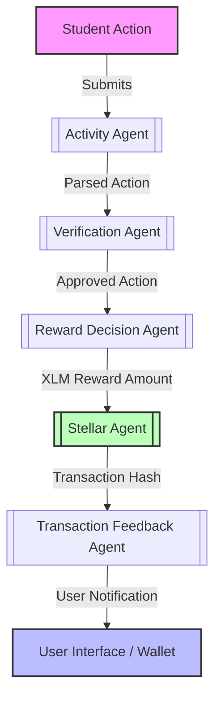

# 🧩 System Overview

Achievo uses a multi-agent system to manage the entire reward lifecycle:
> From student activity submission → verification → reward decision → Stellar XLM payout.

Each responsibility is handled by a specialized "agent" (simulated or real AI).

## 🔄 End-to-End Lifecycle Flow

1. **Submission**: A student submits an activity description (e.g. *"I helped organize the code workshop"*).
2. **Interpretation**: The [[Activity Agent]] parses the natural language input to determine the type of activity.
3. **Verification**: The [[Verification Agent]] runs security/validation checks (e.g., verifying if the activity is on the whitelist or if the user is authorized).
4. **Reward Assignment**: The [[Reward Decision Agent]] computes the XLM reward value based on defined payout rules.
5. **Execution**: The [[Stellar Agent]] interacts with the Stellar Testnet SDK to send the payment from the treasury wallet.
6. **Formatting**: The [[Transaction Feedback Agent]] translates raw transaction hashes/errors into human-readable notifications.
7. **Display**: The UI displays the success or failure screen.
