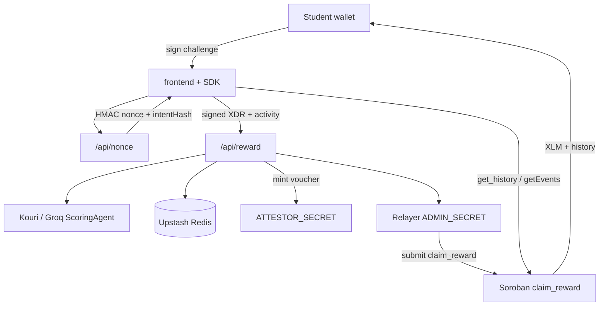
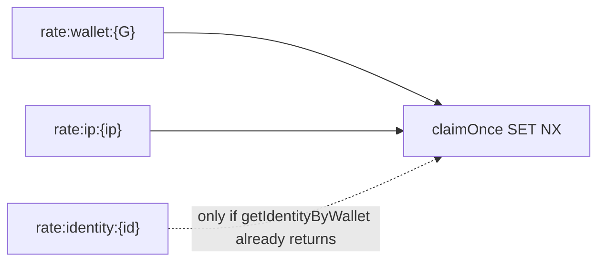

# Achievo Architecture

Achievo pays verified student activities in testnet XLM. The **server** evaluates
submissions and mints attestor-signed vouchers; the **contract** is the payout
gate via `claim_reward` (one-time claim id, expiry, money caps). A server relayer
submits the claim and pays fees. The client proves wallet ownership and displays
results.

## Package graph

```text
@achievo/shared       constants, reward table, daily caps, domain types, stroops
@achievo/identity     Identity types, redact helpers (no Node crypto)
       ↑
@achievo/contracts    Public HTTP request/response DTOs
@achievo/stellar      RPC/Horizon clients, decode, treasury + history views
       ↑
@achievo/sdk          Typed fetch client + submitActivity reward flow
       ↑
frontend/src/app + features/* + shared   Vite React UI
api/*.ts                                 Thin Vercel adapters
api/_server/{http,features,infrastructure,composition}
```

Folder navigation: [`REPO_MAP.md`](REPO_MAP.md).

Dependency rules:

| Package / area | May import |
|---|---|
| `@achievo/shared` | nothing app-specific |
| `@achievo/identity` | nothing app-specific |
| `@achievo/contracts` | `@achievo/shared` (types only as needed) |
| `@achievo/stellar` | `@achievo/shared`, `@stellar/stellar-sdk` |
| `@achievo/sdk` | `@achievo/contracts`, `@achievo/shared` |
| `frontend` | `@achievo/shared`, `@achievo/stellar`, `@achievo/identity`, `@achievo/sdk`, `@achievo/contracts` |
| `api/_server/features/*` | contracts/domain packages + ports; never `@vercel/node` or infrastructure |
| `api/_server/infrastructure/*` | packages + Node/SDK libs; never feature routes/composition |
| `api/_server/composition/*` | features + infrastructure (route-specific wiring only) |
| `api/*.ts` | composition route + HTTP adapter only |
| packages / api | never `frontend` |

See also [`docs/IDENTITY.md`](IDENTITY.md).

The product demo video is hosted externally on Google Drive — not generated from
this repository.

## Authority diagram



## Reward table

Canonical bases and max bonuses live in `@achievo/shared` (`BASE_REWARD`,
`MAX_BONUS`). The UI shows **up to** `base + maxBonus` as an estimate. The
server computes `base + effort × maxBonus` after Groq evaluation.

## History

`useRewardHistory` merges on-chain ledger/events (`getWalletRewardHistory` in
`@achievo/stellar`) with a localStorage optimistic cache. Chain rows win on
`txHash`. Sync runs on connect, after payout, on window focus, and every 15s.

On-chain `history` is a **bounded ring** (max 500 records) with ~31-day TTL
extension on write; instance storage TTL is bumped on `send_reward`. Long-term
truth is the event log (paginated `getEvents`) plus the Redis payout ledger /
reconcile job (`/api/reconcile`).

## Daily economics

| Cap | On-chain | API (Redis) |
|---|---|---|
| Per-tx | 20 XLM | `MAX_REWARD_PER_TX_XLM` |
| Per-recipient / UTC day | 20 XLM | `budget:recipient:day:{day}:{wallet}` |
| Treasury / UTC day | 100 XLM | `budget:treasury:day:{day}` |

Constants live in `@achievo/shared` (`caps.ts`) and must stay aligned with
`contract/src/lib.rs`.

## Scoring

1. `ScoringAgent` (Groq) — full base + effort bonus.
2. On Groq failure → `HeuristicScoringAgent` — whitelist classify, **base-only**
   (`scoringMode: "heuristic"`). Integrity, rate limits, intent binding, and
   daily caps still apply.

## Server layout

Root handlers under `api/*.ts` are thin Vercel adapters. Behavior lives in
`api/_server/`:

| Layer | Role |
|---|---|
| `http/` | Framework-neutral `HttpRequest`/`HttpResult` + Vercel adapter + trusted client IP |
| `features/rewards` | Nonce, reward, payouts, reconcile use cases and narrow ports |
| `features/feedback` | Transaction + general feedback use cases |
| `features/identity` | Identity bind/session routes |
| `features/health` | Health probe route |
| `infrastructure/` | Redis store, Stellar challenge/submit, treasury signer adapter, evaluator, integrity, Forms, Telegram |
| `composition/` | Route-specific port wiring (one module per endpoint family) |
| `services/signer/` | Optional isolated signer (Phase 2) holding `ADMIN_SECRET` |

Reward-family composition is split so `/api/payouts` does not import evaluator,
Stellar submit, integrity, or Telegram modules.

## Hybrid rate keys



- Always claim wallet (+ IP when known).
- If Redis already has an identity for the wallet, also claim `rate:identity:{id}`.
- First-time wallets: no identity yet → only wallet/IP (bind happens after successful payout).
- On failure: release all claimed keys. Recipient Redis budget stays **wallet-keyed** (matches on-chain per-address cap); identity budget moves with rebind later.

## Cap sync

`scripts/check-cap-sync.mjs` compares stroop constants in `contract/src/lib.rs` with
XLM caps in `@achievo/shared`. Wired into `npm run check-contract-integration`.

## Tests

| Suite | Location | Command |
|---|---|---|
| UI / shared / stellar decode | `frontend/src/__tests__` | `npm test -w frontend` |
| SDK | `packages/sdk/__tests__` | `npm test -w @achievo/sdk` |
| API handlers + features | `api/__tests__` | `npm run test:api` |
| Contract | `contract/` | `cargo test` |

Frontend must not import `api/**` (eslint). Prefer `@achievo/*` over deep package paths.
Browser `/api` traffic goes through `@achievo/sdk` via `frontend/src/shared/api/achievoClient.ts`.
`@stellar/stellar-sdk` in the UI is confined to the wallet feature SDK adapter (+ tests).

## Manual regression smoke

1. Connect wallet → fund if needed  
2. Submit activity → sign challenge → payout succeeds  
3. History refreshes; `sessionToken` / `identityId` persisted  
4. Second submit same UTC day → 429 (wallet or identity rate)  

## Security highlights

- Challenge MAC binds `nonce:expiry:intentHash` where `intentHash = sha256(activityText)`.
- Wallet / IP / (hybrid) identity rate limits use atomic `claimOnce` (SET NX); failed payouts release slots.
- Production requires Upstash Redis (`VERCEL_ENV=production` fail-closed).
- `ADMIN_SECRET` and `NONCE_HMAC_SECRET` never ship to the client.
- Public payout/identity APIs redact full wallet addresses.
