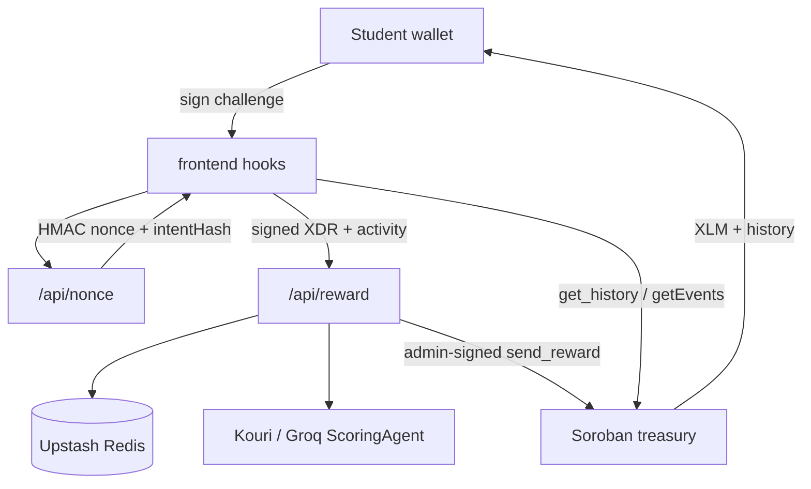
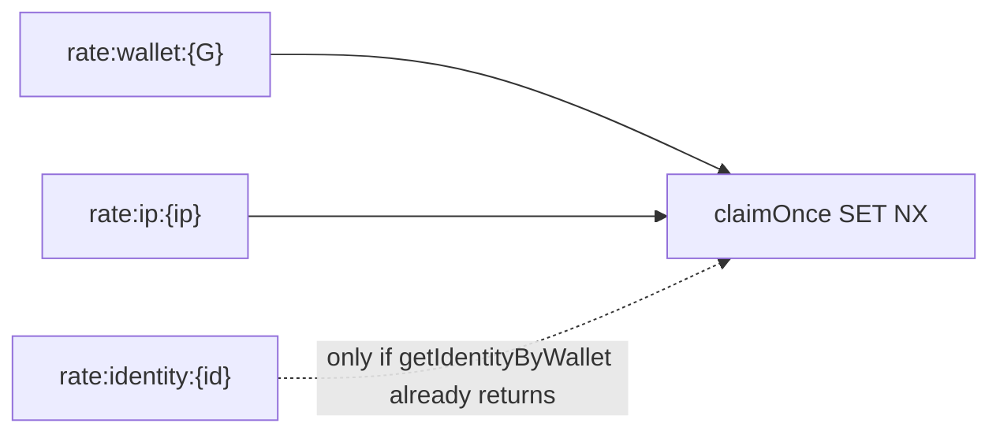

# Achievo Architecture

Achievo pays verified student activities in testnet XLM. The **server** is the
payout authority: it evaluates submissions, signs admin `send_reward` calls, and
enforces rate limits. The client proves wallet ownership and displays results.

## Package graph

```text
@achievo/shared     constants, reward table, daily caps, types, stroops
@achievo/identity   Identity types, redact helpers (no Node crypto)
       ↑
@achievo/stellar    RPC/Horizon clients, decode, treasury + history views
       ↑
frontend/src/app + features/* + hooks   Vite React UI
api/*.ts                                Vercel handlers (root)
api/_lib/{store,payout,identity,notify} server-only helpers
```

Folder navigation: [`REPO_MAP.md`](REPO_MAP.md).

Dependency rules:

| Package / area | May import |
|---|---|
| `@achievo/shared` | nothing app-specific |
| `@achievo/identity` | nothing app-specific |
| `@achievo/stellar` | `@achievo/shared`, `@stellar/stellar-sdk` |
| `frontend` | `@achievo/shared`, `@achievo/stellar`, `@achievo/identity` |
| `api/` | `@achievo/shared`, `@achievo/stellar`, `@achievo/identity`, `api/_lib/*` |
| `api/_lib/*` | never `frontend` |

See also [`docs/IDENTITY.md`](IDENTITY.md).

`tools/remotion-demo-video/` is **not** a workspace member — demo tooling only.

## Authority diagram



## Reward table

Canonical bases and max bonuses live in `@achievo/shared` (`BASE_REWARD`,
`MAX_BONUS`). The UI shows **up to** `base + maxBonus` as an estimate. The
server computes `base + effort × maxBonus` after Groq evaluation.

## History

`useRewardHistory` merges on-chain ledger/events (`getWalletRewardHistory` in
`@achievo/stellar`) with a localStorage optimistic cache. Chain rows win on
`txHash`. Sync runs on connect, after payout, on window focus, and every 15s.

On-chain `history` is a **bounded ring** (max 500 records) with ~31-day TTL
extension on write; instance storage TTL is bumped on `send_reward`. Long-term
truth is the event log (paginated `getEvents`) plus the Redis payout ledger /
reconcile job (`/api/reconcile`).

## Daily economics

| Cap | On-chain | API (Redis) |
|---|---|---|
| Per-tx | 20 XLM | `MAX_REWARD_PER_TX_XLM` |
| Per-recipient / UTC day | 20 XLM | `budget:recipient:day:{day}:{wallet}` |
| Treasury / UTC day | 100 XLM | `budget:treasury:day:{day}` |

Constants live in `@achievo/shared` (`caps.ts`) and must stay aligned with
`contract/src/lib.rs`.

## Scoring

1. `ScoringAgent` (Groq) — full base + effort bonus.
2. On Groq failure → `HeuristicScoringAgent` — whitelist classify, **base-only**
   (`scoringMode: "heuristic"`). Integrity, rate limits, intent binding, and
   daily caps still apply.

## Reward handler steps

`api/reward.ts` is thin orchestration. Steps live under `api/_lib/`:

| Module | Role |
|---|---|
| `api/_lib/payout/challenge.ts` | Verify signed challenge + MAC |
| `api/_lib/payout/rateClaims.ts` | Hybrid wallet / IP / identity rate claims |
| `api/_lib/payout/evaluateSubmission.ts` | Groq → heuristic fallback |
| `api/_lib/payout/dailyBudgets.ts` | Redis treasury + recipient budgets |
| `api/_lib/payout/submitReward.ts` | Build / sign / send / poll `send_reward` |

## Hybrid rate keys



- Always claim wallet (+ IP when known).
- If Redis already has an identity for the wallet, also claim `rate:identity:{id}`.
- First-time wallets: no identity yet → only wallet/IP (bind happens after successful payout).
- On failure: release all claimed keys. Recipient Redis budget stays **wallet-keyed** (matches on-chain per-address cap); identity budget moves with rebind later.

## Cap sync

`scripts/check-cap-sync.mjs` compares stroop constants in `contract/src/lib.rs` with
XLM caps in `@achievo/shared`. Wired into `npm run check-contract-integration`.

## Tests

| Suite | Location | Command |
|---|---|---|
| UI / shared / stellar decode | `frontend/src/__tests__` | `npm test -w frontend` |
| API handlers + agents | `api/__tests__` | `npm run test:api` |
| Contract | `contract/` | `cargo test` |

Frontend must not import `api/**` (eslint). Prefer `@achievo/*` over deep package paths.
`@stellar/stellar-sdk` in the UI is confined to `features/wallet/wallet.ts` (+ tests).

## Manual regression smoke

1. Connect wallet → fund if needed  
2. Submit activity → sign challenge → payout succeeds  
3. History refreshes; `sessionToken` / `identityId` persisted  
4. Second submit same UTC day → 429 (wallet or identity rate)  

## Security highlights

- Challenge MAC binds `nonce:expiry:intentHash` where `intentHash = sha256(activityText)`.
- Wallet / IP / (hybrid) identity rate limits use atomic `claimOnce` (SET NX); failed payouts release slots.
- Production requires Upstash Redis (`VERCEL_ENV=production` fail-closed).
- `ADMIN_SECRET` and `NONCE_HMAC_SECRET` never ship to the client.
- Public payout/identity APIs redact full wallet addresses.
