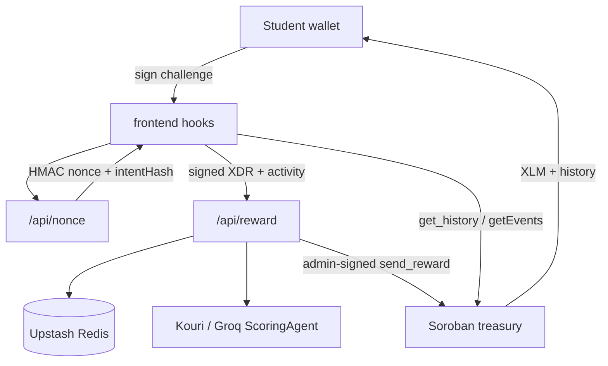

# Achievo Architecture

Achievo pays verified student activities in testnet XLM. The **server** is the
payout authority: it evaluates submissions, signs admin `send_reward` calls, and
enforces rate limits. The client proves wallet ownership and displays results.

## Package graph

```text
@achievo/shared     constants, reward table, daily caps, types, stroops
@achievo/identity   Identity types, redact helpers (no Node crypto)
       ↑
@achievo/stellar    RPC/Horizon clients, decode, treasury + history views
       ↑
frontend            Vite React UI (hooks + screens)
api/                Vercel handlers + _lib server-only helpers
```

Dependency rules:

| Package / area | May import |
|---|---|
| `@achievo/shared` | nothing app-specific |
| `@achievo/identity` | nothing app-specific |
| `@achievo/stellar` | `@achievo/shared`, `@stellar/stellar-sdk` |
| `frontend` | `@achievo/shared`, `@achievo/stellar`, `@achievo/identity` |
| `api/` | `@achievo/shared`, `@achievo/stellar`, `@achievo/identity`, `api/_lib/*` |
| `api/_lib/*` | never `frontend` |

See also [`docs/IDENTITY.md`](IDENTITY.md).

`tools/remotion-demo-video/` is **not** a workspace member — demo tooling only.

## Authority diagram



## Reward table

Canonical bases and max bonuses live in `@achievo/shared` (`BASE_REWARD`,
`MAX_BONUS`). The UI shows **up to** `base + maxBonus` as an estimate. The
server computes `base + effort × maxBonus` after Groq evaluation.

## History

`useRewardHistory` merges on-chain ledger/events (`getWalletRewardHistory` in
`@achievo/stellar`) with a localStorage optimistic cache. Chain rows win on
`txHash`. Sync runs on connect, after payout, on window focus, and every 15s.

## Daily economics

| Cap | On-chain | API (Redis) |
|---|---|---|
| Per-tx | 20 XLM | `MAX_REWARD_PER_TX_XLM` |
| Per-recipient / UTC day | 20 XLM | `budget:recipient:day:{day}:{wallet}` |
| Treasury / UTC day | 100 XLM | `budget:treasury:day:{day}` |

Constants live in `@achievo/shared` (`caps.ts`) and must stay aligned with
`contract/src/lib.rs`.

## Scoring

1. `ScoringAgent` (Groq) — full base + effort bonus.
2. On Groq failure → `HeuristicScoringAgent` — whitelist classify, **base-only**
   (`scoringMode: "heuristic"`). Integrity, rate limits, intent binding, and
   daily caps still apply.

## Security highlights

- Challenge MAC binds `nonce:expiry:intentHash` where `intentHash = sha256(activityText)`.
- Wallet/IP rate limits use atomic `claimOnce` (SET NX); failed payouts release the slot.
- Production requires Upstash Redis (`VERCEL_ENV=production` fail-closed).
- `ADMIN_SECRET` and `NONCE_HMAC_SECRET` never ship to the client.
- Public payout/identity APIs redact full wallet addresses.
